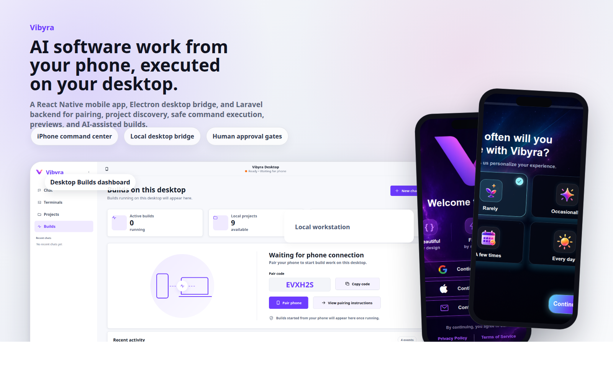
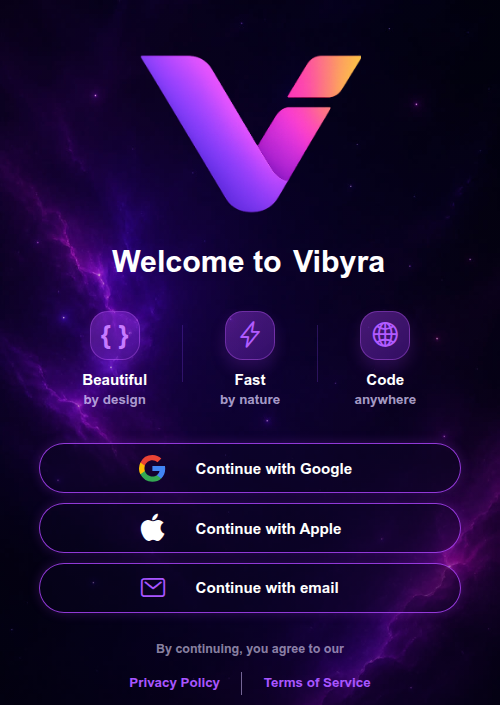
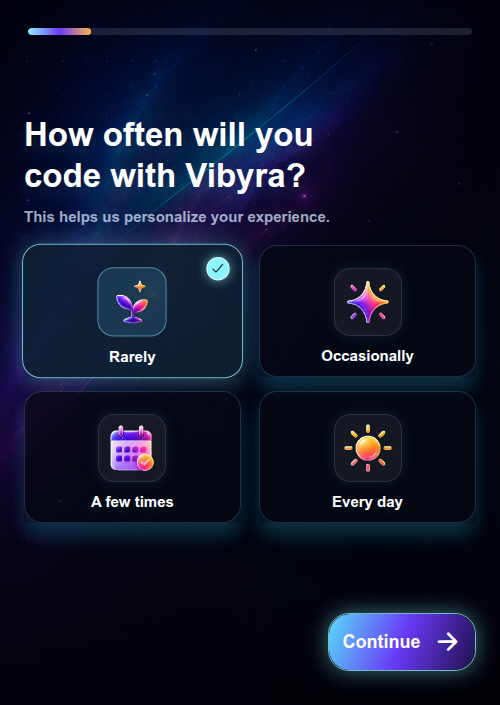
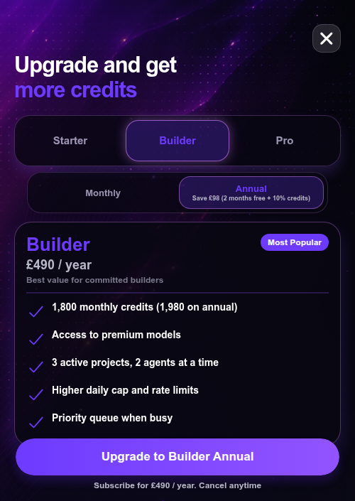

# Vibyra



Vibyra is a mobile command center for AI software workflows running on a user's own machine. The iPhone app gives the user a high-level, portable way to start work, approve local access, inspect projects, launch previews, and review AI-generated changes while the desktop bridge performs the local project discovery, preview serving, command execution, and file operations.

This repository demonstrates a complete cross-device product: Expo React Native on mobile, an Electron/local HTTP desktop bridge, and a Laravel backend for auth, billing, cloud state, community publishing, moderation, referrals, and AI chat routing.

## Product Highlights

- **Phone-first AI workflow control:** start project work from iPhone while the actual filesystem and commands stay on the user's desktop.
- **Approval-gated local access:** pairing, browsing, command execution, and AI edit application are designed around explicit user permission.
- **Project-aware AI builds:** Vibyra discovers local projects, prepares project context, runs model-backed workflows, and returns pending edits for apply/discard.
- **Live preview loop:** local app previews can be started from the desktop bridge and surfaced back to the mobile app.
- **Professional account layer:** auth, billing plans, credit limits, device sessions, referral tracking, and community publishing are handled through the backend.
- **Desktop companion app:** a polished desktop shell shows Builds, Projects, Chat, terminal workflows, phone connection status, and account controls.

## Screenshots

<p>
  
  
  
</p>

## Architecture

```text
iPhone app (Expo React Native)
  -> account, onboarding, workspace, chat, project browsing, approvals
  -> talks to the Laravel API and paired desktop bridge

Desktop bridge (Electron + local Node HTTP server)
  -> serves the desktop shell
  -> pairs with the phone
  -> discovers local projects
  -> starts previews, safe commands, AI runs, terminals, and pending edit flows

Backend (Laravel)
  -> auth, sessions, billing, credits, OpenRouter-backed chat, cloud sync,
     referrals, community publishing, moderation, and hosted demos
```

## Engineering Notes

- **Cross-device state management:** pairing and workspace state are split across mobile context modules, desktop bridge state, and backend session data.
- **Human-in-the-loop safety:** desktop operations use pairing tokens and explicit approval routes before local project access or file changes are exposed.
- **Modular desktop bridge:** route dispatch, pairing, project discovery, previews, agent runs, PTY terminals, account state, and static shell assets are separated into focused modules under `desktop/lib` and `desktop/assets`.
- **Backend product depth:** the Laravel app includes migrations, models, billing services, credit deduction, moderation services, community publishing models, and session/device management.
- **Testing surface:** targeted Node tests cover desktop preview behavior, agent state, AI terminal wrappers, desktop chat, model config, preview diagnostics, and mobile utility logic.

## Tech Stack

- **Mobile:** Expo, React Native, TypeScript, React Native Reanimated, WebView, AsyncStorage.
- **Desktop:** Electron, Node HTTP server, browser-based desktop shell, xterm.js, local project and preview tooling.
- **Backend:** Laravel, SQLite-ready local development, billing and credit services, account/session APIs, community publishing APIs.
- **AI workflow:** OpenRouter-backed chat/build routing, model tiering, reasoning effort controls, pending generated file handling, and safe command execution.

## Repository Map

```text
src/                       Expo React Native app
src/context/               Pairing, workspace, cloud sync, AI agent, and app state
src/screens/               Auth, onboarding, welcome, and workspace screens
desktop/                   Local desktop bridge and static desktop shell
desktop/lib/               Desktop routes, pairing, projects, previews, agents, terminals
desktop/assets/            Desktop shell JavaScript, CSS, and UI assets
backend/                   Laravel API, billing, auth, sessions, community, moderation
Vibyra/_ai/                Project memory and architecture notes for agent workflows
docs/assets/               README screenshots and showcase imagery
```

## Run Locally

Install dependencies:

```bash
npm install
```

Start the backend and Expo app together:

```bash
npm start
```

Open the Expo URL with Expo Go on iPhone, or run a native iOS build from macOS with Xcode/EAS.

Start the desktop bridge in a separate terminal:

```bash
npm run desktop
```

Pairing flow:

1. Open **Vibyra Desktop** first.
2. Leave the desktop bridge running.
3. Open the iPhone app.
4. Enter the desktop pairing code in the Vibyra pairing screen.
5. Approve the request on the desktop, then approve on the phone.

After pairing, the phone can list local projects, start preview sessions, send prompts to the desktop workflow, receive pending diff metadata, run the safe command set, and show live updates.

## Useful Commands

```bash
npm run backend                 # Laravel backend only
npm run desktop                 # Desktop bridge and desktop shell
npm run ios                     # Expo iOS target
npm run web                     # Expo web target
npm run typecheck               # TypeScript check
npm run test:desktop-preview    # Desktop preview tests
```

## Why This Project Matters

Vibyra is not a single-screen demo. It is a full product system that combines mobile UX, local desktop automation, backend account infrastructure, billing controls, AI routing, preview tooling, and explicit safety boundaries. It shows end-to-end product engineering across frontend, desktop, backend, and AI workflow design.
