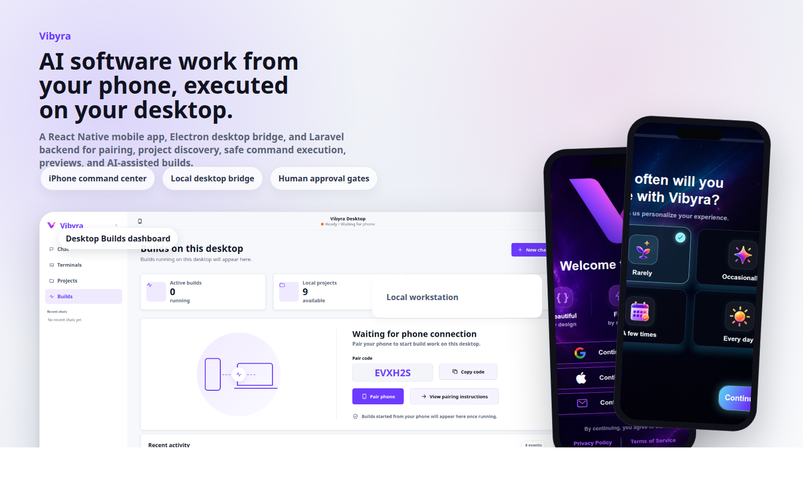
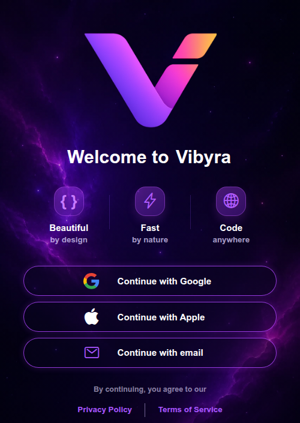
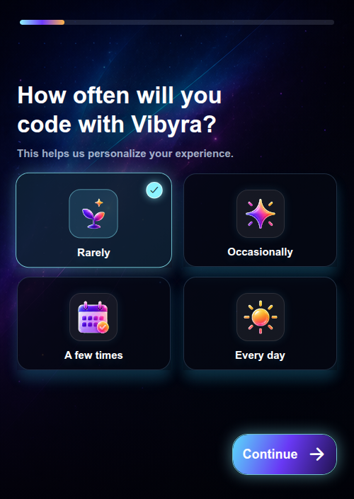
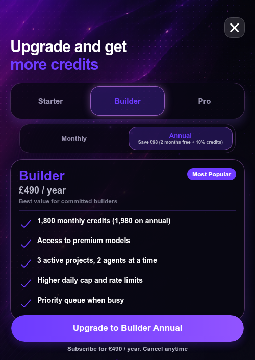

# Vibyra



Vibyra runs AI software workflows on a user's own machine. Vibyra Desktop is a native Tauri 2 + Rust app that orchestrates multiple AI CLI agents (Claude Code, Codex, Gemini and more) in a fast terminal grid, with per-project sessions, previews, voice input, and screenshot capture. The iPhone app gives the user a portable way to manage their account, browse the community, and run AI chat workflows.

This repository holds the complete product: a Tauri 2 + Rust desktop app, an Expo React Native mobile app, and a Laravel backend for auth, billing, cloud state, community publishing, moderation, referrals, and AI chat routing.

## Product Highlights

- **Multi-agent terminal workspace:** run Claude, Codex, Gemini and other AI CLIs side by side in one native terminal grid, scoped per project.
- **Approval-gated local access:** pairing, browsing, command execution, and AI edit application are designed around explicit user permission.
- **Project-aware AI builds:** Vibyra discovers local projects, prepares project context, runs model-backed workflows, and returns pending edits for apply/discard.
- **Live preview loop:** local app previews can be started from the desktop app and inspected element by element.
- **Professional account layer:** auth, billing plans, credit limits, device sessions, referral tracking, and community publishing are handled through the backend.
- **Native desktop app:** a frameless Tauri shell with project switching, an AI chat and memory dock, model picker, and account controls.

## Screenshots

<p>
  
  
  
</p>

## Architecture

```text
Vibyra Desktop (Tauri 2 + Rust + React + xterm.js)
  -> native PTY terminals for AI CLI agents, per project
  -> project discovery, file tree, previews, screenshots, voice input
  -> account auth against the Laravel API

iPhone app (Expo React Native)
  -> account, onboarding, workspace, chat, community
  -> talks to the Laravel API

Backend (Laravel)
  -> auth, sessions, billing, credits, OpenRouter-backed chat, cloud sync,
     referrals, community publishing, moderation, and hosted demos
```

## Engineering Notes

- **State management:** workspace state is split across mobile context modules, the desktop app's Rust core and zustand stores, and backend session data.
- **Human-in-the-loop safety:** desktop launches can run behind safe-mode git worktrees with explicit approval before local changes are touched.
- **Modular desktop core:** PTY handling, output batching, the agent catalog, filesystem watching, previews, and settings live in the dependency-light `vibyra-core` Rust crate, separate from the Tauri shell.
- **Backend product depth:** the Laravel app includes migrations, models, billing services, credit deduction, moderation services, community publishing models, and session/device management.
- **Testing surface:** Rust unit tests cover the desktop core, Node tests cover the desktop frontend and mobile utility logic, and PHPUnit covers the backend.

## Tech Stack

- **Mobile:** Expo, React Native, TypeScript, React Native Reanimated, WebView, AsyncStorage.
- **Desktop:** Tauri 2, Rust, React, TypeScript, xterm.js, portable-pty, Vite.
- **Backend:** Laravel, SQLite-ready local development, billing and credit services, account/session APIs, community publishing APIs.
- **AI workflow:** OpenRouter-backed chat/build routing, model tiering, reasoning effort controls, pending generated file handling, and safe command execution.

## Repository Map

```text
src/                       Expo React Native app
src/context/               Pairing, workspace, cloud sync, AI agent, and app state
src/screens/               Auth, onboarding, welcome, and workspace screens
desktop-tauri/             Vibyra Desktop (Tauri 2 + Rust + React)
desktop-tauri/src/         Desktop frontend: terminals, projects, panels, stores
desktop-tauri/src-tauri/   Tauri shell, commands, and the vibyra-core Rust crate
backend/                   Laravel API, billing, auth, sessions, community, moderation
Vibyra/_ai/                Project memory and architecture notes for agent workflows
docs/assets/               README screenshots and showcase imagery
```

## Run Locally

### Desktop app

```bash
cd desktop-tauri
npm ci
npm run app:dev
```

On Linux, install the GTK/WebKit build dependencies first with
`desktop-tauri/scripts/setup-linux.sh`.

To produce a package, run `npm run app:build:linux` (AppImage) or
`npm run app:build:windows` (NSIS) from `desktop-tauri/`.

Requirements: Node.js, npm, and a stable Rust toolchain.

### Full mobile development

Install dependencies and start the backend and Expo app together:

```bash
npm install
npm start
```

Open the Expo URL with Expo Go on iPhone, or run a native iOS build from macOS with Xcode/EAS.

## Useful Commands

```bash
npm run backend                 # Laravel backend only
npm run ios                     # Expo iOS target
npm run web                     # Expo web target
npm run typecheck               # TypeScript check
npm run check:mobile            # Mobile line limits, typecheck, and tests

cd desktop-tauri && npm run app:dev    # Run Vibyra Desktop
cd desktop-tauri && npm run verify     # Desktop release gates
```

## Why This Project Matters

Vibyra is not a single-screen demo. It is a full product system that combines a native desktop app, mobile UX, backend account infrastructure, billing controls, AI routing, preview tooling, and explicit safety boundaries. It shows end-to-end product engineering across native desktop, frontend, backend, and AI workflow design.
