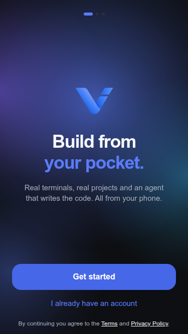

# Vibyra

Build from your pocket. Vibyra's iPhone app connects to a computer you approve
and gives you access to real projects, terminals, and coding agents.

This repository contains one mobile application, in `mobile/`, alongside
Vibyra Desktop, the standalone Host, and the Laravel backend.

## Run the iPhone app in Expo Go

Use Node.js 22.12 or newer and the SDK 57 version of Expo Go.

```bash
npm ci --prefix mobile
bash host/scripts/build-wasm.sh
npm run phone
```

The transport build uses Rust 1.97.1 and wasm-bindgen 0.2.127. Install the Rust
toolchain with `rustup toolchain install 1.97.1 --profile minimal` if needed.
Sign into the same Expo account in the CLI and Expo Go, then scan the LAN QR.
The first page says **Build from your pocket.** and offers **Get started** and
**I already have an account**. To reopen it, use **Settings → Show welcome again**.

`npm start` and `npm run dev` launch this same app. `npm run web` opens its
browser preview. `npm run ios` builds a development client on macOS with Xcode.
The root package only routes commands; it is not a second Expo project.



## Connect your computer

```bash
bash host/scripts/run.sh --project /absolute/path/to/project --pair
```

Host defaults to loopback. For phone testing, use the private-LAN listener and
public URL options documented in [mobile/README.md](mobile/README.md), then
approve the phone's pairing request in the Host console. Accounts are optional
for computer pairing. The phone-only coding path is marked as rolling out.

The new app uses the standalone Host. Existing Vibyra Desktop chats do not yet
synchronize into it. Native store signing and public service qualification
remain separate work; this repository contains an Expo Go development app.

## Repository map

| Path | Purpose |
| --- | --- |
| `mobile/` | The sole iPhone/Expo app, beginning at `WelcomeStep.tsx` |
| `host/` | Encrypted transport, computer sessions, project access and relay |
| `desktop-tauri/` | Native Tauri desktop application and shared PTY core |
| `backend/` | Laravel website, accounts and shared APIs |
| `Vibyra/_ai/` | Project memory and focused workflow notes |

## Desktop

```bash
cd desktop-tauri
npm ci
npm run app:dev
```

On Linux, install GTK/WebKit dependencies using
`desktop-tauri/scripts/setup-linux.sh` first.

## Checks

```bash
npm run check:mobile
npm --prefix mobile run export
cargo +1.97.1 test --locked --manifest-path host/Cargo.toml --workspace
node --test scripts/mobile-entrypoints.test.mjs
```

The mobile checks cover type safety, account/onboarding state, transport and
terminal behavior, and source organization. `mobile/scripts/verify-ui.mjs`
checks the rendered onboarding and workspace; `verify-host-ui.mjs` exercises
real local Host sessions. See [mobile/README.md](mobile/README.md) for details.
