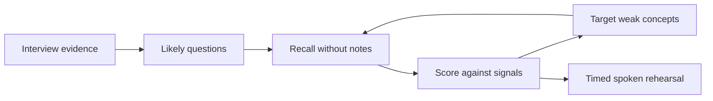

# Interview Preparation System

This is the reusable operating system for turning any interview invitation into focused, evidence-based practice. It preserves the learning method used by [[01 Projects/Portfolio/Zoom Interview Prep|Zoom Interview Prep]] while keeping each employer's context separate.

> [!tip] Fast start for the next interview
> 1. Create `01 Projects/Interviews/<Company - Role>/`.
> 2. Create the hub from [[90 Templates/Interview Prep/Interview Hub Template|Interview Hub Template]].
> 3. Add the job advert, recruiter emails, people, stages, dates, and company research to [[90 Templates/Interview Prep/Interview Context Template|Interview Context Template]].
> 4. Build only the likely question bank, evidence stories, and technical concepts for that role.
> 5. Practise aloud, score against explicit signals, and study weak areas again.

## Why this learning method is efficient

The system uses a short feedback loop:

- **Active recall:** answer before viewing a model answer.
- **Retrieval practice:** revisit weak cards more often than mastered cards.
- **Deliberate practice:** score missing evidence, not confidence alone.
- **Interleaving:** rotate technical, behavioural, company, and role questions.
- **Spaced repetition:** use short sessions across several days.
- **Transfer:** explain architecture aloud and redraw it from memory.
- **Truthfulness:** model answers are structures to adapt, never scripts to claim unchanged.

## Minimum useful preparation pack

Every interview project needs six connected parts:

1. **Context:** role, company, people, stages, dates, products, and explicit requirements.
2. **Evidence bank:** truthful examples from past projects with measurable or verifiable outcomes.
3. **Question bank:** likely questions, expected signals, follow-ups, and red flags.
4. **Knowledge bank:** technical concepts in plain English and role-specific language.
5. **Practice loop:** typed/spoken attempts with scores and one next focus.
6. **Delivery plan:** opening pitch, questions to ask, logistics, and final rehearsal.

## Recommended sequence

### Phase 1 — Ground the preparation

- Save the complete job description and all interview messages verbatim or as faithful summaries.
- Record what is known versus inferred.
- Map each stated requirement to evidence in [[02 Areas/Technical Career Evidence|Technical Career Evidence]].
- Identify gaps that need learning; never invent experience to fill them.

### Phase 2 — Build high-yield material

- Prioritise questions by likelihood × importance × current weakness.
- Prepare a small set of adaptable stories rather than a unique story for every question.
- Write expected signals before writing a model answer.
- For technical questions, use: **problem → architecture → trade-offs → reliability → customer impact**.
- For behavioural questions, use: **situation → responsibility → action → result → lesson**.

### Phase 3 — Practise under pressure

- Attempt without notes.
- Keep most answers to 60–120 seconds unless depth is requested.
- Score evidence, structure, specificity, trade-offs, and outcome.
- Write exactly one next improvement after each attempt.
- Reattempt weak questions later, not immediately from short-term memory.

### Phase 4 — Final readiness

- Deliver the opening pitch naturally.
- Complete a mixed mock interview.
- Redraw the key architecture from a blank page.
- Prepare thoughtful questions for the interviewer.
- Confirm time, timezone, link/location, names, and required materials.

## Readiness rule

Readiness is evidence, not a feeling. Mark ready when:

- [ ] Every explicit role requirement maps to a truthful example or an honest learning response.
- [ ] Priority questions have at least two spoken attempts.
- [ ] Weak concepts have been recalled correctly on separate days.
- [ ] Core stories can flex across multiple questions.
- [ ] Technical answers include choices, failure handling, and measurable impact.
- [ ] Logistics and interviewer questions are complete.

## Templates

- [[90 Templates/Interview Prep/Interview Hub Template|Interview Hub Template]]
- [[90 Templates/Interview Prep/Interview Context Template|Interview Context Template]]
- [[90 Templates/Interview Prep/Interview Question Template|Interview Question Template]]
- [[90 Templates/Interview Prep/Interview Story Template|Interview Story Template]]
- [[90 Templates/Interview Prep/Interview Study Session Template|Interview Study Session Template]]

## Reference implementation

- [[01 Projects/Portfolio/Zoom Interview Prep|Zoom Interview Prep]]
- [[01 Projects/Portfolio/Zoom Interview Prep/Zoom Learning Method|Zoom Learning Method]]
- [[01 Projects/Portfolio/Zoom Interview Prep/Zoom App Rebuild Specification|Zoom App Rebuild Specification]]

