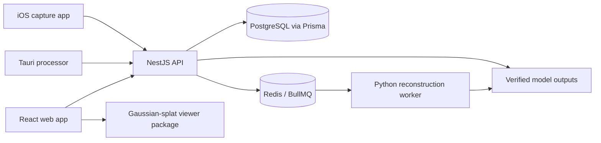
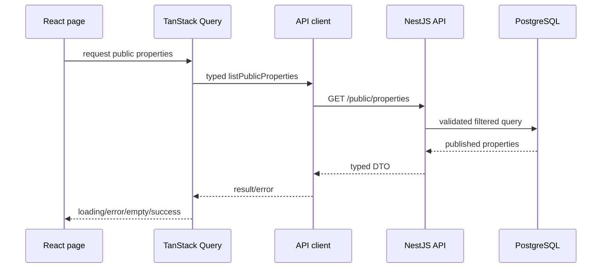

# RealEstate — Architecture

## Application boundaries

| Area | Location | Responsibility |
|---|---|---|
| Web | `apps/web` | React routes, public site, agent/customer UI |
| API | `apps/api` | typed HTTP boundary, auth, orchestration, public APIs |
| Desktop | `apps/desktop` | Tauri UI and desktop OS command boundary |
| iOS | `apps/mobile-ios` | native capture |
| Reconstruction | `workers/reconstruction` | computer-vision and reconstruction execution |

## Shared packages

| Package | Responsibility |
|---|---|
| `packages/shared-types` | DTOs and enums |
| `packages/validation` | runtime validation schemas |
| `packages/database` | Prisma schema, migrations, database access |
| `packages/api-client` | typed API transport |
| `packages/ui` | reusable UI components |
| `packages/viewer` | viewer-specific rendering and state |
| `packages/config` | shared TypeScript/lint configuration |

## Boundary rules

- Web only reaches persisted data through the API client.
- API schedules reconstruction; it does not directly execute computer-vision tools.
- Reconstruction executables remain behind allowlisted adapter interfaces.
- Every schema change requires a new migration; applied migrations are immutable.
- Processing must persist progress/errors and must not report 100% before upload verification.

## Frontend data path

