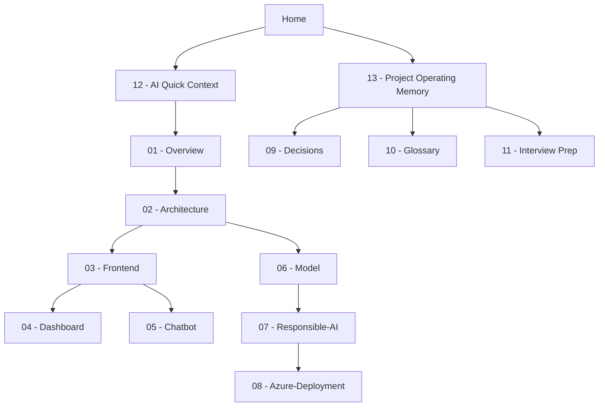

# Azure Project Home - Map of Content

The single entry point for the **Service Priority AI** project vault. Start here before reading source code.

> [!tip] AI quick start
> Read [[12 - AI Quick Context]] first, then [[13 - Project Operating Memory]], then follow the links below for the area being changed.

## Start here

- [[12 - AI Quick Context]] - one-screen project brief for AI sessions
- [[13 - Project Operating Memory]] - durable constraints, current state, and next checks
- [[01 - Overview]] - the one-paragraph version, goals, audience
- [[02 - Architecture]] - how data flows from synthetic generation to dashboard

## Build it

- [[03 - Frontend]] - React app: public portal + console + chatbot rail
- [[04 - Dashboard]] - employee casework dashboard and manager MLOps assurance
- [[05 - Chatbot]] - grounded `/chat` assistant
- [[06 - Model]] - the scikit-learn pipeline, features, and metrics

## Ship it responsibly

- [[07 - Responsible-AI]] - advisory stance, fairness, human review
- [[08 - Azure-Deployment]] - online + batch managed endpoints

## Reference

- [[09 - Decisions]] - why things are the way they are
- [[10 - Glossary]] - terminology
- [[11 - Interview Prep]] - Essex AI / ML Engineer presentation plan
- [[14 - Interview Cue Card (Simple)]] - plain-English slide-by-slide script, Q&A, RelayClarity + ML examples

## Project graph

## Quick facts

- Model: `service-priority-ai-baseline` **v0.1.0** - see [[06 - Model]]
- Validation accuracy approximately **90%**, high-priority recall approximately **94%**
- Decision mode: **advisory** + human-in-the-loop - see [[07 - Responsible-AI]]
- Backend routes: `/predict`, `/chat`, `/metrics/summary`, `/dashboard/summary`
- Verified Azure demo details live in [[08 - Azure-Deployment]] and [[11 - Interview Prep]]

#servicePriorityAI #moc
