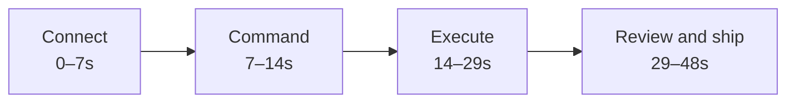

# Vibyra Remotion Marketing Video Plan

> [!abstract] Creative thesis
> Make a fast, premium 48-second product film that turns Vibyra's real phone-to-desktop workflow into one continuous visual idea: **your computer does the work; you stay in control from anywhere**. The hero arc is `pair → choose project → speak or type → many terminals vibe-code with shared Memory → review → approve → preview`. Every transition should advance that workflow.

> [!success] Implemented 2026-07-17
> The editable Remotion project is in `remotion/`, with the `VibyraLaunch36` composition at 1920 × 1080, 60 fps, and 36 seconds. It uses clean, faithful Atlas-only desktop and phone UI recreations to show connection, project prompting, six concurrent terminals, Vibyra AI Talk, built-in Memory, model choice, review/approval, and Live Preview without exposing real local paths or unrelated projects. Three restrained transition families—cobalt sweep, opposing shutter, and radial pulse—keep the cut fast while leaving product frames unobstructed. Decorative grids, scan rules, signal bars, and progress tracks are intentionally excluded; transfers and milestones instead use filled glow volumes, particle pops, springing detail pills, illuminated status dots, and controlled camera pushes. `npm run render` writes the web master to `backend/public/media/vibyra-launch-film.mp4`; `npm run poster` writes its poster beside it. The public homepage renders `backend/resources/js/marketing/ProductFilm.jsx` immediately after the immersive hero and loads the film on demand with native controls.

## Executive Direction

### Recommended master

- Runtime: `48 seconds`.
- Master format: `3840 × 2160`, `60 fps`, 16:9.
- Primary destinations: Vibyra website hero, YouTube/X/LinkedIn launch post, product presentations.
- Derived cuts: `30s`, `15s`, `6s`; 9:16 and 1:1 adaptations.
- Style: product-first kinetic UI, graphite stage, cobalt signal paths, sharp typography, restrained cinematic depth.
- Tone: capable, fast, precise, human-controlled.
- Core line: **Build here. Review anywhere.**
- CTA: **Start building with Vibyra.**

### Viewer takeaway

Within five seconds, a viewer must understand all three facts:

1. Vibyra connects an iPhone to a desktop computer.
2. AI agents work on real projects on that computer.
3. The user can supervise and approve the work from the phone.

The next fifteen seconds must establish the desktop differentiator: Vibyra is not one generic chat window. It is a voice-enabled AI workspace where the user can run many live coding terminals in parallel and give them durable, project-specific Memory. The full video should prove those claims with real interface states rather than explain them with a feature list.

## Product Reality Reviewed

The plan is grounded in current source, current Vibyra memory, and the latest local captures rather than speculative screens.

### iOS/phone surface

Verified in `App.tsx`, `src/`, and [[Vibyra App Memory]]:

- Account/auth and cinematic welcome.
- Desktop discovery, pairing, reconnect, and connection state.
- Project and folder discovery from the paired computer.
- Project-aware AI chat with model and reasoning controls.
- Suggested actions for fixing bugs, building features, refactoring, and shipping.
- Live run/tool activity inside the conversation.
- Explicit approval or denial of edits and preview-server starts.
- Changed-files review, undo/revert paths, and runnable previews.
- In-app Live Preview through the native WebView.
- Projects, project creation, search, status, and PC/mobile source filters.
- Explore/community discovery and approved project publishing.
- Profile, usage, billing, appearance, language, security, and account controls.

### Desktop surface

Verified in `desktop/app.html`, `desktop/assets/`, and [[Vibyra Desktop Memory]]:

- Graphite/Cobalt Electron shell with Terminals and Projects as the main destinations.
- Phone pairing and desktop approval.
- Local project discovery and project filtering.
- Multiple simultaneous AI terminal workspaces for parallel, terminal-first vibe coding.
- Provider/account support across OpenAI, Anthropic, and Google surfaces.
- New-agent setup, model selection, project selection, and permission controls.
- Coordinated teams and concurrent agent work across many visible terminals.
- Vibyra AI Talk: a real push-to-talk conversation that understands the active terminal, project, model, reasoning, and project context.
- Separate F8 terminal dictation that transcribes speech into the terminal selected when recording begins.
- Built-in project Memory with imported Markdown/Obsidian notes, editable notes, search, Graph/Notes views, and project context supplied to supported AI terminals.
- Editor, Preview/Test, console/inspection tools, and phone preview handoff.
- Screenshots, crop/annotation, local checkpoints, and recovery-oriented controls.

### What the film must not imply

- Do not invent a cloud execution architecture; desktop work runs on the user's computer.
- Do not imply edits apply without approval when an approval boundary exists.
- Do not show fake completion percentages or fabricated productivity metrics.
- Do not imply every provider, model, plan, or feature is free.
- Do not show planned website routes or product surfaces as shipped.
- Do not use private repositories, real tokens, personal email, personal files, or live customer data.

## Research Synthesis

### Patterns worth adopting

- Google reports that successful app video ads average at least two cut changes in the first five seconds, recommends reaching the app experience quickly, and advises early/continuous branding. The opening therefore uses three meaningful product cuts before `00:05`, with the V mark present as product chrome rather than a detached logo bumper. [Google app creative guidance](https://support.google.com/google-ads/answer/6167158)
- YouTube skippable inventory exposes the skip control after five seconds. The complete promise and first proof therefore land before that point. [Google video campaign formats](https://support.google.com/google-ads/answer/6340491)
- Apple recommends a cohesive story made from real in-app footage; App Store previews may be up to 30 seconds and should stay inside the app rather than showing filmed hands. The separate App Store cut will use only captured iOS UI and will omit the cinematic device-stage shots. [Apple App Previews](https://developer.apple.com/app-store/app-previews/)
- Raycast markets cross-device continuity by adapting a familiar desktop utility into a mobile companion and leads with one clear mobile promise rather than an exhaustive capability list. That is close to Vibyra's desktop/iPhone relationship, but Vibyra should differentiate through visible agent execution, approvals, and preview handoff. [Raycast for iOS](https://www.raycast.com/ios)
- Raycast's internal marketing philosophy connects launches to genuinely demanded features, creates curiosity that leads to trying the product, and coordinates one feature story across video, landing page, social, and release timing. Vibyra should launch this film with matching clips and copy rather than treating it as an isolated asset. [Raycast Hype Team](https://www.raycast.com/blog/hype-team)
- Linear's recent agent marketing makes agent activity and visible human judgment central. Vibyra should similarly show what the agents are doing and where the user retains control, rather than using a vague “AI magic” animation. [Linear Agent](https://linear.app/changelog/2026-03-24-introducing-linear-agent)
- Vibyra's existing competitor research records the viral strength of a single, concrete autonomous coding demo in Devin's launch. The useful lesson is the specificity of the proof, not the “fully autonomous” framing. See [[Competitor Marketing Analysis#2.3.5 Devin (Cognition) — viral demo, $25B valuation]].

### Patterns to avoid

- A slow logo-only opening.
- Ten unrelated feature cards flying at the camera.
- Constant glitching, chromatic aberration, or generic purple AI glow.
- Tiny unreadable full-screen recordings with no crop or focus treatment.
- Cursor choreography that looks synthetic or performs impossible actions.
- Copy that claims “build anything” without showing a concrete result.
- Transitions chosen independently per scene; the film needs a repeatable visual grammar.
- A voice-over that narrates every click.

## Narrative System

### One-sentence story

A developer pairs their phone, asks Vibyra to improve a real project, speaks a follow-up to Vibyra AI, watches many desktop terminals vibe-code in parallel using shared project Memory, approves the change from iPhone, and opens the finished result wherever they are.

### Four acts



### Emotional curve

- `0–5s`: curiosity and immediate comprehension.
- `5–14s`: agency — the user chooses the project and gives the command.
- `14–24s`: scale and intelligence — one command fans out into many coding terminals, a spoken follow-up becomes action, and project Memory supplies durable context.
- `24–36s`: trust — progress and edits remain visible and approval stays human.
- `36–44s`: payoff — the real result opens as a live product.
- `44–48s`: memory — product name, positioning, CTA.

## Detailed 48-Second Shot List

| Time | Frames at 60 fps | Picture and action | On-screen copy | Motion and transition | Audio |
| --- | ---: | --- | --- | --- | --- |
| `00:00–00:01.2` | `0–71` | Black/graphite. A thin cobalt pulse traces the V mark, then resolves into the real Vibyra logo. The pulse continues off-screen instead of stopping. | `Vibyra` appears for only the last 12 frames. | Path-reveal logo; no long hold. Pulse becomes the next scene's connection line. | One low impact, short digital inhale, first beat begins. |
| `00:01.2–00:02.8` | `72–167` | The cobalt line races left to a clean desktop frame and right to an iPhone frame. Both UI surfaces snap into focus. | **Your AI workspace. Everywhere.** | 3D camera push, 4% parallax, line-driven reveal. | Two sync clicks on device arrival. |
| `00:02.8–00:04.8` | `168–287` | Three rapid proof cuts: desktop pairing request; iPhone connection state; paired cobalt status dots on both devices. | `Connect once.` | Two 6-frame luminance flashes and one match cut through the shared status dot. | Pairing ping; beat gains percussion. |
| `00:04.8–00:07.0` | `288–419` | iPhone comes forward. Projects view scrolls a short distance and selects a staged project named `Atlas`. Desktop project row highlights at the same moment. | `Your projects. On your computer.` | Phone rises from device pair; selection edge sends a signal to the desktop row. | Soft scroll ticks, selection click. |
| `00:07.0–00:10.8` | `420–647` | Phone chat. A concise prompt types quickly: `Add the analytics overview, test it, and open a preview.` Send button compresses and releases. | None; the prompt is the copy. | Macro crop on composer; type-on in readable chunks, not one character per frame. Send launches a cobalt packet. | Key clusters, send thunk, beat briefly ducks. |
| `00:10.8–00:13.4` | `648–803` | The packet crosses the device gap and lands in Desktop Terminal setup. Atlas, the chosen model, and the permission mode are already visible; `Start` fires. | **One request. Any terminal.** | Match cut from phone send icon to desktop play icon. UI is real; animation is the connective layer. | Rising tonal sweep. |
| `00:13.4–00:17.2` | `804–1031` | One desktop workspace expands into a six-pane live terminal grid. OpenAI-, Claude-, Gemini-, or Vibyra-backed sessions wake in a 2×3 wave, each with a real task and safe staged output. | **Vibe-code in parallel.** | Signature “agent fan-out”: one terminal scales and subdivides; 4-frame stagger per pane; project groups and status dots ripple cobalt. | Six quiet activation ticks; bass arrives on full grid. |
| `00:17.2–00:20.0` | `1032–1199` | Vibyra AI switches from Chat to Talk. The push-to-talk field turns live and the user says: `Use Atlas Memory. Keep the current design language.` The transcript lands and Vibyra responds. | **Speak to Vibyra.** | Voice rings pulse from the microphone into the active project tab, then collapse into a clean transcript row. Never imply always-on listening. | Realistic mic-open cue, short spoken line, transcription resolve. |
| `00:20.0–00:23.5` | `1200–1409` | The built-in Memory `Project brain` opens: graph nodes and a relevant design note illuminate, then cobalt paths feed that context into the active terminals. The phone remains visible with live activity cards updating. | **Shared project Memory.** | Match the voice waveform to a Memory graph edge; three relevant nodes brighten while unrelated nodes remain neutral; terminal headers receive a subtle context pulse. | Memory shimmer, three restrained status sounds, percussion continues. |
| `00:23.5–00:27.0` | `1410–1619` | Phone changed-files/permission card appears. A compact diff glimpse shows the named files. User taps `Approve`. | **You stay in control.** | Everything pauses for 8 frames before approval. Button press sends a clean horizontal cobalt sweep back to desktop. | Music half-beat pause, tactile approval click, resolved chord. |
| `00:27.0–00:30.8` | `1620–1847` | Desktop applies edits, test row turns success green, and preview becomes ready. Avoid fake percentage bars. | `Applied` · `Tests passed` · `Preview ready` | Three status chips land on successive beats; result remains legible for 20 frames. | Three ascending confirmations. |
| `00:30.8–00:34.2` | `1848–2051` | Rapid secondary-capability burst: model/provider selection, Monaco editor, Preview inspector, screenshot annotation. Each gets one unmistakable action while the terminal grid continues behind it. | `Choose.` `Edit.` `Inspect.` `Capture.` | Four quadrant flashes, 32–40 frames each; one shared camera orbit makes them feel connected. | Four high-frequency ticks over a single rising sweep. |
| `00:34.2–00:38.6` | `2052–2315` | Phone taps `Open live preview`. The preview card expands beyond the phone bezel and becomes a full-screen staged app. Show the analytics overview requested earlier. | **See the result anywhere.** | Signature “preview bloom”: card corner radius animates to zero while the phone frame recedes. | Music reaches main peak; airy expansion. |
| `00:38.6–00:41.6` | `2316–2495` | Full-screen result interacts once: chart filter changes and a number updates. Then the view folds back into phone and desktop side by side. | `Real project. Real preview.` | One honest interaction; no fake analytics claims. Fold uses the same geometry as preview bloom in reverse. | UI click, success sparkle, music begins resolving. |
| `00:41.6–00:44.5` | `2496–2669` | Fast closing proof montage: desktop agents still working; phone project status; an Explore publish-ready card. End on connected status across both devices. | `Build.` `Review.` `Ship.` | Three 0.7–0.9s match cuts; final shared cobalt line collapses into V mark. | Three beat accents; final riser. |
| `00:44.5–00:48.0` | `2670–2879` | Clean graphite end card with V mark, product name, line, and CTA. Small device silhouettes remain as a faint watermark. | **Build here. Review anywhere.**<br>`Start building with Vibyra` | Logo settles with a high-damping spring. CTA fades 8 frames later. Hold final readable state for at least 2.2s. | Brand mnemonic: three notes; clean tail. |

> [!important] Pacing rule
> “Quick” does not mean every shot is short. The film earns speed with the 0–5s and 13–20s bursts, then uses the approval and preview moments as deliberate holds. Without those holds, the viewer cannot understand or trust the workflow.

## Exact Voice-Over

The preferred master uses sparse voice-over and works without it through supers.

> “Your best AI work shouldn't be tied to one chat — or to your desk. Connect Vibyra to your computer, choose a real project, then type or speak. Launch the AI terminals you want and vibe-code in parallel. Vibyra's built-in project Memory keeps the right context close while every terminal stays visible. Follow the work from your phone. Review the files. Approve the change. Open the result anywhere. Vibyra. Build here. Review anywhere.”

### Voice direction

- Calm British or internationally neutral voice; confident, not breathless.
- Approximately 73 words across 43 seconds, delivered briskly with space around the live voice demonstration, approval, and preview sounds.
- Read “Vibyra” once in the opening only if brand pronunciation needs reinforcement; always read it on the end card.
- Do not say “autonomous,” “instant,” “unlimited,” or “one click.”

### Silent-first requirement

Every core claim must remain understandable with audio muted. Supers should be five words or fewer, use sentence case, and remain inside platform-safe title areas.

## Motion Design Language

### The three transition families

Use only these families for 90% of transitions:

1. **Signal transfer** — a cobalt line, packet, or edge travels between phone and desktop to show causality.
2. **Spatial morph** — a card, pane, or preview retains its geometry while expanding into the next scene.
3. **Beat flash** — a 4–8 frame neutral/cobalt luminance overlay hides a hard cut during the fastest montage moments.

This gives the film variety without visual randomness.

### Signature animations

#### Agent fan-out

- Start with one 16:9 terminal viewport.
- Animate `scaleX` to `0.49` and duplicate into two columns.
- Split the columns into three rows with a 4-frame cascade.
- Retain the originating prompt briefly as a shared header, then let it dissolve into individual task labels.
- Status dots activate left-to-right, then top-to-bottom.
- Do not simulate agent output in Remotion if clean real captures can be used; composite and time-remap genuine staged sessions.

#### Voice-to-work handoff

- Use the real Vibyra AI Talk state, including explicit push-to-talk, live microphone feedback, transcript, and Vibyra response.
- Animate the voice field only while the user is actively holding/toggling the real control; do not imply passive or always-on listening.
- Transform the final waveform into a cobalt route that lands on the active Atlas project and then enters Memory.
- Keep the spoken phrase under three seconds and show matching transcript text so the feature works in muted playback.
- Treat F8 terminal dictation as an optional 15-second/social alternate; the master should prioritize Vibyra AI Talk because it demonstrates an actual conversation with project-aware AI.

#### Memory recall

- Use a real synthetic Atlas vault with a small, legible Graph and a note called `Design language`.
- Highlight only the notes/links genuinely relevant to the staged task.
- Match-cut one graph edge into the top borders of the terminal panes to communicate shared context without claiming live cross-agent memory synchronization beyond the product's real context injection.
- Follow with one readable proof crop: an agent references the cobalt/graphite design rule before editing.

#### Preview bloom

- Track the actual bounds of the preview card inside the phone capture.
- Render the full preview as a second layer aligned exactly over that card.
- Interpolate position, size, border radius, and shadow over 28–34 frames.
- Add only 2–3% overshoot with high damping.
- End with one real UI interaction so the viewer knows it is an interactive preview, not a screenshot.

#### Cobalt connection

- Use the canonical accent `#5B7CFA` on dark backgrounds.
- Keep the line 2–4 physical pixels in 4K, with a restrained soft halo.
- Let particles appear only during transfer events; never keep ambient particles over every scene.
- A transfer must correspond to a real action: pair, send, approve, or open preview.

### Camera and depth

- Default product view is nearly front-on for legibility.
- Maximum device rotation: `6°` on X/Y.
- Maximum camera push per shot: `8%`.
- Background depth blur may separate devices, but captured UI must stay sharp.
- Use transform-only animation for most scene movement; avoid animating expensive full-frame CSS blur every frame.
- Apply motion blur selectively to device transitions and fast overlays, not to terminal text.

### Type treatment

- Use the closest licensed production typeface to Vibyra's current UI; prefer Inter/Geist-style neutral sans if no brand font is locked.
- Hero supers: 72–96 px at 4K, weight 650–750.
- Supporting supers: 42–56 px at 4K.
- Never show more than two lines of overlay copy.
- Keep type neutral white/muted gray; cobalt is for one highlighted word or rule, not entire headlines.

### Colour system

- Canvas: `#0E0F12`.
- Rail/depth surfaces: `#13151A`, `#181A20`, `#20232A`.
- Primary text: `#F5F7FA`; muted: `#A6ADBA`.
- Accent: `#5B7CFA`; action fill: `#4667E8`.
- Success: `#37C78A`, only after real success states.
- Warning and error remain semantic.
- Maintain the approved 90% graphite / 8% cobalt / 2% semantic-colour balance from [[Graphite And Cobalt Colour System]].

## Screen-Capture Production Plan

### Staged demo project

Create a dedicated, synthetic project named `Atlas` with no credentials or personal data. The requested feature should be visually obvious and feasible to capture:

- Before: a clean bookings dashboard without analytics.
- Prompt: `Add the analytics overview, test it, and open a preview.`
- After: one chart, three honest demo metrics, a date filter, and responsive layout.
- Files: concise names such as `AnalyticsOverview.tsx`, `analytics.css`, and `AnalyticsOverview.test.tsx`.
- Tests: deterministic, quick, and staged to pass.

The result must be a real local project and real preview. It may use synthetic business data, clearly disconnected from Vibyra's own performance claims.

### Required desktop captures

| Capture ID | State | Framing | Notes |
| --- | --- | --- | --- |
| `D01` | Pairing request and approval | 16:9 full shell + macro crop | Use a generic device name such as `Demo iPhone`. |
| `D02` | Projects list with Atlas | Full shell | Remove unrelated real projects from the capture profile. |
| `D03` | Terminal setup ready | Medium crop | Project/model/permission state must be truthful. |
| `D04` | Six-terminal grid launching | 16:9 full shell | Record at 60 fps if possible; use six safe sessions with real project tasks and truthful provider/model labels. |
| `D05` | Vibyra AI Talk conversation | Medium + tight crop | Capture idle, mic-live, transcribing, response, and transcript states using the real push-to-talk workflow. |
| `D06` | Memory Project brain | Medium + tight crop | Use a synthetic Atlas vault with real Markdown notes, Graph/Notes views, and a readable `Design language` note. |
| `D07` | Agent visibly using Memory context | Tight crop | Capture a real supported terminal session referencing the staged design note; do not fake a provider-memory badge. |
| `D08` | File edit in Editor | Tight crop | Large font and short code lines. |
| `D09` | Test run success | Tight crop | No fake percentages; capture actual pass state. |
| `D10` | Preview/Test inspector | Medium crop | Use actual Atlas preview. |
| `D11` | Screenshot annotation | Medium crop | Annotate a synthetic UI issue. |
| `D12` | Applied/preview-ready state | Medium crop | Capture real event order. |

### Required iPhone captures

| Capture ID | State | Framing | Notes |
| --- | --- | --- | --- |
| `M01` | Auth/welcome brand frame | Native iPhone | Optional opening texture only; do not spend time on sign-in. |
| `M02` | Desktop discovery/pairing | Native iPhone | Show Demo Desktop and safe network state. |
| `M03` | Connected PC status | Native iPhone | Pair status must match D01. |
| `M04` | Projects list and Atlas selection | Native iPhone | Search and selection should be one clean action. |
| `M05` | Prompt composition and send | Native iPhone | Use the exact hero prompt. |
| `M06` | Live plan/tool activity | Native iPhone | Capture actual staged run events. |
| `M07` | Changed files/edit permission | Native iPhone | Approval wording must match current product. |
| `M08` | Preview ready and open action | Native iPhone | Capture native WebView transition where stable. |
| `M09` | Atlas live preview interaction | Native iPhone | One filter interaction is enough. |
| `M10` | Publish-ready/Explore state | Native iPhone | Use only if the staged project meets the real publish flow. |

### Capture hygiene

- Use a dedicated demo OS account and Vibyra account.
- Hide taskbar/menu bar unless the environment itself is meaningful.
- Disable notifications, clock/date exposure, personal avatars, recent files, and unrelated terminals.
- Use one stable desktop resolution and one named iPhone target throughout.
- Increase terminal and editor text size before recording; never digitally zoom illegible 12 px text later.
- Capture at least two seconds of clean handles before and after each action.
- Capture clean plates of empty device frames and product chrome.
- Record pointer position separately when possible; add a consistent motion-designed cursor only for desktop interactions that need focus.
- Keep a capture log with app commit, resolution, theme, route, staged data version, and retake status.

## Remotion Implementation Architecture

No Remotion package currently exists in the repository. Add an isolated root workspace at `remotion/` so video dependencies, captured media, and render scripts do not inflate or couple the Expo/Electron runtime.

```text
remotion/
├── package.json
├── remotion.config.ts
├── public/
│   ├── audio/
│   ├── captures/desktop/
│   ├── captures/mobile/
│   ├── fonts/
│   ├── logos/
│   └── sfx/
├── src/
│   ├── Root.tsx
│   ├── compositions/
│   │   ├── LaunchFilm48.tsx
│   │   ├── LaunchCut30.tsx
│   │   ├── SocialCut15.tsx
│   │   ├── Bumper6.tsx
│   │   └── AppStorePreview30.tsx
│   ├── scenes/
│   │   ├── BrandOpen.tsx
│   │   ├── PairDevices.tsx
│   │   ├── SelectProject.tsx
│   │   ├── SendPrompt.tsx
│   │   ├── AgentFanOut.tsx
│   │   ├── SpeakToVibyra.tsx
│   │   ├── MemoryRecall.tsx
│   │   ├── WorkProof.tsx
│   │   ├── ReviewApprove.tsx
│   │   ├── PreviewBloom.tsx
│   │   └── EndCard.tsx
│   ├── components/
│   │   ├── DeviceStage.tsx
│   │   ├── DesktopFrame.tsx
│   │   ├── IPhoneFrame.tsx
│   │   ├── ProductCapture.tsx
│   │   ├── SignalPath.tsx
│   │   ├── KineticType.tsx
│   │   ├── Cursor.tsx
│   │   ├── SafeArea.tsx
│   │   └── Grain.tsx
│   ├── motion/
│   │   ├── timing.ts
│   │   ├── transitions.tsx
│   │   ├── camera.ts
│   │   └── reducedMotion.ts
│   ├── data/
│   │   ├── timeline.ts
│   │   ├── copy.ts
│   │   └── captures.ts
│   └── styles/
│       ├── tokens.ts
│       └── typography.ts
└── scripts/
    ├── validate-assets.mjs
    ├── render-master.mjs
    └── render-variants.mjs
```

### Composition strategy

- Build each narrative beat as a named scene with explicit duration constants.
- Keep the 48-second master timeline in `data/timeline.ts`; variants reuse scenes with different copy/framing rather than duplicating animation logic.
- Use `<Sequence>` for local timing and nested animation blocks. Remotion sequences time-shift child frames, which keeps each scene's animation local and testable. [Remotion Sequence](https://www.remotion.dev/docs/sequence)
- Use `<TransitionSeries>` only for scene-to-scene transitions and overlays. Its overlays are well suited to flash/light treatments because they do not shorten the adjacent scenes, while transitions deliberately overlap them. [Remotion TransitionSeries](https://www.remotion.dev/docs/transitions/transitionseries)
- Use `spring()` for device settles, button response, and preview bloom; cap overshoot and prefer high damping for a premium UI feel. [Remotion spring](https://www.remotion.dev/docs/spring)
- Use `interpolate()` for deterministic camera, crop, opacity, and path progress.
- Use `OffthreadVideo` for screen recordings to improve render reliability and frame extraction.
- Put music, voice-over, and sound effects on separate audio tracks with named timing constants.
- Preload fonts and critical captures; fail validation if a referenced asset is missing.

### Timing tokens

```ts
export const FPS = 60;
export const beat = {
  flash: 6,
  cut: 12,
  fast: 20,
  standard: 32,
  deliberate: 48,
};

export const springConfig = {
  ui: { damping: 24, stiffness: 220, mass: 0.8 },
  device: { damping: 30, stiffness: 180, mass: 1 },
  logo: { damping: 34, stiffness: 150, mass: 0.9 },
};
```

Exact values should be tuned against the soundtrack, but the shared tokens prevent every component from inventing its own motion feel.

### Data-driven timeline

Each scene record should include:

- `id` and human-readable label.
- start/end frames and transition duration.
- capture IDs, crop rectangles, and device placement.
- supers and accessibility transcript.
- music cue, voice-over cue, and SFX cue.
- supported aspect ratios.
- whether it is allowed in the App Store cut.

This allows one source of truth to produce edit sheets, captions, render variants, and QA screenshots.

## Audio Direction

### Music

- 118–124 BPM electronic track with a clean pulse, restrained low end, and a lift at `00:13` for agent fan-out.
- Avoid cyberpunk distortion, trailer braams, and generic corporate ukulele.
- Structure: sparse intro, rhythmic build, execution peak, half-beat approval pause, preview payoff, three-note brand close.
- Secure commercial rights that explicitly cover paid social, website, App Store, and perpetuity if possible.

### Sound design

- Create a small brand vocabulary: cobalt transfer, agent wake, approval click, success chirp, preview bloom, three-note mnemonic.
- UI clicks should be tactile but quieter than the voice-over.
- Pan signal sounds subtly between desktop and phone positions in the stereo field.
- Do not add a sound to every text line or terminal update.
- Target approximately `-14 LUFS` integrated for social/web delivery, with true peak below `-1 dBTP`; confirm platform requirements at export time.

## Variant Plan

### 30-second campaign cut

- Keep pairing, prompt, multi-terminal fan-out, a combined voice/Memory proof, approval, preview, and end card.
- Remove most of the secondary capability burst.
- Land the prompt by `00:07`, approval by `00:19`, preview by `00:24`.
- Use for website autoplay with sound option, paid social, and standard product ads.

### 15-second social cut

- `0–2s`: phone/desktop hook and brand.
- `2–5s`: prompt.
- `5–9s`: six-terminal fan-out, one-beat Talk waveform, and one-beat Memory graph proof.
- `9–12s`: approve and preview bloom.
- `12–15s`: tagline and CTA.
- No voice-over required; use bold supers and brand SFX.

### 6-second bumper

- Phone sends prompt → desktop splits into agents → finished preview expands → V mark.
- Copy: **Build here. Review anywhere.**
- Brand is visible from the first frame as product chrome.

### 9:16 vertical cut

- Stack desktop behind/above the phone; never shrink a full 16:9 desktop recording into an unreadable center strip.
- Use large macro crops of terminal panes and changed-file cards.
- Reserve top/bottom safe zones for platform UI.
- Recompose every scene; do not merely crop the 16:9 render.

### App Store preview

- Maximum 30 seconds.
- Show only iOS app UI captured from the target device.
- No external device mockups, filmed hands, desktop UI, or claims unsupported by in-app behavior.
- Use pairing state, project selection, chat request, run activity, approval, and Live Preview.
- Create a strong poster frame around the preview-ready or live-preview result.

## Production Phases and Gates

### Phase 1 — Lock the promise

- Approve the 48-second narrative and exact hero prompt.
- Decide whether the CTA is download, waitlist, or website visit based on launch readiness.
- Confirm features shown are release-ready for the intended publish date.
- Freeze the demo project and synthetic data.

**Gate:** anyone shown the animatic without audio can explain Vibyra in one sentence after one viewing.

### Phase 2 — Capture proof

- Build Atlas before/after states.
- Create clean desktop and iPhone demo accounts/profiles.
- Capture the D01–D10 and M01–M10 matrix.
- Record clean audio/UI reference and capture metadata.
- Review each clip for privacy, truthfulness, legibility, and continuity.

**Gate:** every claim in the shot list has a real, clean source clip.

### Phase 3 — Motion prototype

- Scaffold the isolated Remotion workspace.
- Implement device stage, typography, signal transfer, agent fan-out, and preview bloom.
- Build a grayscale 48-second animatic first.
- Add real captures only after timing works.

**Gate:** motion grammar feels coherent with only three transition families.

### Phase 4 — Picture lock

- Replace placeholders with final captures.
- Tune crops, holds, supers, and UI focus.
- Remove any shot that requires explanation or duplicates another proof.
- Review at 100% desktop size and on a real phone.

**Gate:** no key text is too small, no action is impossible, and the story still reads muted.

### Phase 5 — Sound and finishing

- Record/edit voice-over.
- License and edit music.
- Add restrained SFX and brand mnemonic.
- Apply final colour management, grain, and motion blur.
- Caption and transcript the master.

**Gate:** voice, music, and SFX each remain intelligible; the mix never hides UI feedback.

### Phase 6 — Variants and launch package

- Render 16:9 master, 30/15/6-second cuts, 9:16, and 1:1.
- Produce App Store-specific 30-second preview.
- Export poster frames, thumbnails, GIF/MP4 hero loop, and stills for launch copy.
- Pair the film with the website headline and social posts so every channel repeats the same promise.

**Gate:** all variants use the same truth-checked source timeline and approved CTA.

## QA Checklist

### Product truth

- [ ] Pairing state matches on phone and desktop.
- [ ] The selected project remains Atlas throughout.
- [ ] Prompt, changed files, test result, and preview all describe the same feature.
- [ ] The Talk shot uses explicit real push-to-talk state and never implies always-on listening.
- [ ] Memory nodes, notes, links, and terminal context are derived from the real synthetic Atlas vault rather than decorative fake data.
- [ ] Provider/model labels in the multi-terminal grid match the actual launched sessions.
- [ ] Approval happens before the applied result.
- [ ] No fabricated performance, usage, or revenue number appears.
- [ ] Provider and plan availability is represented accurately.

### Visual quality

- [ ] No legacy purple/pink Vibyra chrome is introduced.
- [ ] UI remains sharp after scaling and export.
- [ ] Text is readable on a 390 px-wide phone preview.
- [ ] No shot depends on reading more than one short terminal paragraph.
- [ ] Motion has natural acceleration/deceleration and no accidental jitter.
- [ ] Flash overlays pass a photosensitivity review; avoid rapid high-contrast strobing.
- [ ] End card holds at least 2.2 seconds.

### Technical render

- [ ] Deterministic render: the same frame renders identically twice.
- [ ] No missing fonts, images, video frames, or audio assets.
- [ ] No dropped/duplicated frames at capture boundaries.
- [ ] H.264 web delivery and high-quality mezzanine export both pass visual review.
- [ ] Audio sync is checked at the first frame, approval pause, preview bloom, and final mnemonic.
- [ ] Captions match the final voice-over exactly.
- [ ] 16:9, 9:16, and 1:1 safe areas are reviewed independently.

### Platform delivery

- [ ] Website version has a muted-autoplay-safe poster and first frame.
- [ ] Social versions show product/brand before `00:02`.
- [ ] App Store preview contains only allowed in-app footage and is within 30 seconds.
- [ ] Thumbnail communicates phone + desktop + active agent work without tiny copy.
- [ ] CTA matches the actual public availability at publish time.

## Success Measurement

Use the film to test comprehension and action, not only aesthetic preference.

- Five-second comprehension: can viewers state “AI work on my computer, controlled from my phone”?
- Three-second hold rate on social.
- 25%, 50%, 75%, and completion retention for the master and 15-second cut.
- CTA click-through and download/start conversion.
- Website hero interaction and downstream signup rate.
- Qualitative recall: do viewers mention pairing, agents working, approval, or Live Preview?

Produce two opening variants for a small test:

- **A — Connection hook:** phone and desktop pair immediately.
- **B — Outcome hook:** finished preview appears first, then rewinds through the workflow.

Keep the rest of the video identical so the opening is the only major variable.

## Final Recommendation

Approve the `48-second “Build here. Review anywhere.”` concept as the master. It showcases Vibyra's broad feature set without turning the film into a catalogue because every secondary feature supports one continuous proof: a real project moves from a phone instruction to visible desktop execution, human approval, and a live result back on the phone.

The non-negotiable hero moments are:

1. Paired phone and desktop before five seconds.
2. A real, concise build prompt.
3. One terminal fanning out into six live AI coding terminals.
4. A real Vibyra AI Talk interaction showing that the user can speak to the desktop app.
5. The built-in Memory Project brain supplying real Atlas project context.
6. Visible parallel vibe coding, progress, editing, and testing.
7. Human approval of changes.
8. A real preview opening on iPhone.
9. The final line: **Build here. Review anywhere.**

Everything else is optional and should be cut if it weakens comprehension, truthfulness, or pace.
