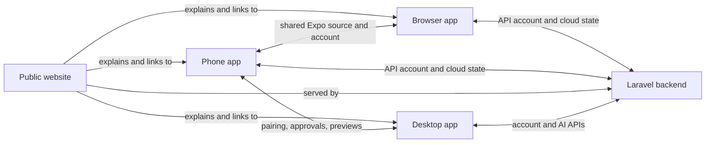

# Vibyra Product Surfaces

Use this note first when “website,” “browser,” “phone app,” or “desktop app”
could be ambiguous. The surfaces share the Vibyra brand, account, projects,
and preview story, but they are separate user experiences with different jobs.

| Surface | Purpose | Source owner | Local run |
| --- | --- | --- | --- |
| Public website | Public marketing, explanation, pricing, trust, and download entry points. It is not the signed-in product client. | `backend/routes/web.php`, `backend/resources/views/marketing.blade.php`, `backend/resources/js/marketing/`, `backend/resources/css/marketing.css` | From `backend/`: `php artisan serve --host=127.0.0.1 --port=8000`; choose another free port if occupied. Run `npm run dev` there only when live-editing Vite assets. |
| Browser app | The Expo/React Native product client rendered by React Native Web in a desktop browser. It is the phone product adapted to a browser runtime, not the public website. | Root `App.tsx`, `src/`, `app.config.js` | From repo root: `npm run web`. |
| Phone app | The native iOS/Android command centre for pairing, chat, approvals, projects, and Live Preview. | Root `App.tsx`, `src/`, `app.config.js`, `eas.json` | From repo root: `npm run ios` or `npm run android`; Expo development can also use `npx expo start`. |
| Desktop app | The native Tauri 2 + Rust app for AI CLI terminals, local projects, previews, and account controls. It is not the public website or the browser app. | `desktop-tauri/`, especially `desktop-tauri/src/App.tsx` and `desktop-tauri/src-tauri/` | From `desktop-tauri/`: `npm run app:dev`. |

## Shared Content, Different Presentation

- Public website copy may explain phone, browser, and desktop capabilities, but
  must not reuse authenticated product navigation or imply planned routes ship.
- Browser and phone apps share `App.tsx` and most of `src/`; platform-specific
  WebView, navigation, permissions, and device behavior keep their runtimes
  distinct.
- Desktop uses the same account and visual language, while owning local-machine
  access, terminals, pairing approval, and preview execution.
- Live Preview is a linked capability, not another product surface: Desktop
  starts/proxies a project and the phone/browser client displays it.

## Link Map

## Related Memory

- Phone/browser client: [[Vibyra App Memory]]
- Desktop companion: [[Vibyra Desktop Memory]]
- Website host and shared APIs: [[Vibyra Backend Memory]]
- Phone/Desktop preview path: [[App/Live Preview]] and [[Desktop/Projects And Preview]]
- Public-site product/content direction: [[Marketing/Vibyra Marketing Website Master Plan]]

## Current Website Reality

The public homepage is implemented at Laravel `GET /` and mounts
`marketing-root`. The broader `/product`, `/desktop`, `/mobile`, `/pricing`,
and other sitemap routes in the master plan remain planned until their routes
and pages exist. Do not confuse the root repo `index.html` placeholder with the
public website.

For local serving, use `php artisan serve --host=127.0.0.1 --port=<free-port>`.
Do not pass `public/index.php` directly as PHP's router script: it routes Vite's
compiled CSS/JS asset requests through Laravel and returns HTML, causing strict
MIME errors and a blank page. If starting PHP manually, use Laravel's
`Foundation/resources/server.php` router with `backend/public` as the working
directory, then verify compiled JS responds as `application/javascript`.

The homepage now uses the product-led software and phone design described in
[[Marketing/Marketing Website]]. `marketing/App.jsx` mounts focused sections
from `marketing/home/`: interactive desktop and Agent/Code/Chat walkthroughs,
feature stories, the upcoming phone companion, control, API-backed plans, FAQs
and download/account actions. Product illustrations are explicitly demos.
Legacy scroll-video source is retained but no longer mounted. The September
2026 comprehensive marketing request supersedes the old short film-led layout.

Use `npm run website` at the active repo root for the standalone local site on
`http://127.0.0.1:8128`. `scripts/marketing/verify.mjs` covers responsive browser
screens, keyboard interactions, real destinations, accessibility and pricing
failure/retry. See the focused marketing note for prerequisites and the crucial
published-tag versus current-branch distinction.
