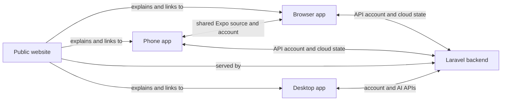

# Vibyra Product Surfaces

Use this note first when “website,” “browser,” “phone app,” or “desktop app”
could be ambiguous. The surfaces share the Vibyra brand, account, projects,
and preview story, but they are separate user experiences with different jobs.

| Surface | Purpose | Source owner | Local run |
| --- | --- | --- | --- |
| Public website | Public marketing, explanation, pricing, trust, and download entry points. It is not the signed-in product client. | `backend/routes/web.php`, `backend/resources/views/marketing.blade.php`, `backend/resources/js/marketing/`, `backend/resources/css/marketing.css` | From `backend/`: `php artisan serve --host=127.0.0.1 --port=8000`; choose another free port if occupied. Run `npm run dev` there only when live-editing Vite assets. |
| Browser app | The Expo/React Native product client rendered by React Native Web in a desktop browser. It is the phone product adapted to a browser runtime, not the public website. | Root `App.tsx`, `src/`, `app.config.js` | From repo root: `npm run web`. |
| Phone app | The native iOS/Android client for account, chat, projects, community, and mobile previews. | Root `App.tsx`, `src/`, `app.config.js`, `eas.json` | From repo root: `npm run ios` or `npm run android`; Expo development can also use `npx expo start`. |
| Desktop app | The native Tauri 2 + Rust app for AI CLI terminals, local projects, previews, and account controls. It is not the public website or the browser app. | `desktop-tauri/`, especially `desktop-tauri/src/App.tsx` and `desktop-tauri/src-tauri/` | From `desktop-tauri/`: `npm run app:dev`. |

## Shared Content, Different Presentation

- Public website copy may explain phone, browser, and desktop capabilities, but
  must not reuse authenticated product navigation or imply planned routes ship.
- Browser and phone apps share `App.tsx` and most of `src/`; platform-specific
  WebView, navigation, permissions, and device behavior keep their runtimes
  distinct.
- Desktop uses the same account and visual language, while independently owning
  local-machine access, terminals, and preview execution. The removed Electron
  bridge's phone pairing and LAN proxy are not part of the Tauri product.

## Link Map

## Related Memory

- Phone/browser client: [[Vibyra App Memory]]
- Desktop companion: [[Vibyra Desktop Memory]]
- Website host and shared APIs: [[Vibyra Backend Memory]]
- Phone preview: [[App/Live Preview]]
- Native desktop preview: [[Desktop/Projects And Preview]]
- Public-site product/content direction: [[Marketing/Vibyra Marketing Website Master Plan]]

## Current Website Reality

The public homepage is implemented at Laravel `GET /` and mounts
`marketing-root`. The broader `/product`, `/desktop`, `/mobile`, `/pricing`,
and other sitemap routes in the master plan remain planned until their routes
and pages exist. Do not confuse the root repo `index.html` placeholder with the
public website.

For local serving, use `php artisan serve --host=127.0.0.1 --port=<free-port>`.
Do not pass `public/index.php` directly as PHP's router script: it routes Vite's
compiled CSS/JS asset requests through Laravel and returns HTML, causing strict
MIME errors and a blank page. If starting PHP manually, use Laravel's
`Foundation/resources/server.php` router with `backend/public` as the working
directory, then verify compiled JS responds as `application/javascript`.

The homepage scroll-video hero must remain one immersive full-screen stage.
Never replace it with permanent side-by-side or stacked text/video panels. Show
the entire clip with `object-contain`; keep Start, Send, Run, and Review copy to
one short headline plus one short sentence; and render each chapter in a compact
dark glass caption so it stays readable over every scene and screen size. The
hero entry is `backend/resources/js/marketing/Hero.jsx`; focused beam, terminal,
stage-showcase, and scroll-video components remain in the same folder. The
single CSS entry stays `backend/resources/css/marketing.css`, which imports the
focused files under `backend/resources/css/marketing/`. Preserve class names,
DOM order, copy, CSS rule order, and the single compiled CSS asset when making
organizational-only changes. Keep the direct video stream underneath the
blob-buffered scrub layer so the first frame is visible immediately without
sacrificing reliable forward/backward scroll seeking on the local PHP server.

After the immersive hero, keep the shipped homepage deliberately short:
`SimpleOverview` (three workflow steps plus one real product capture), compact
row-based Pricing, four essential FAQs, and one final action. Do not restore the
second product film, separate architecture/outcomes/depth sections, repeated
proof galleries, or a capability atlas to the homepage; those systems repeated
the same story and made the only shipped public page feel like a feature
dashboard. The launch-film component and media may remain available as source
material for a future dedicated product page.
