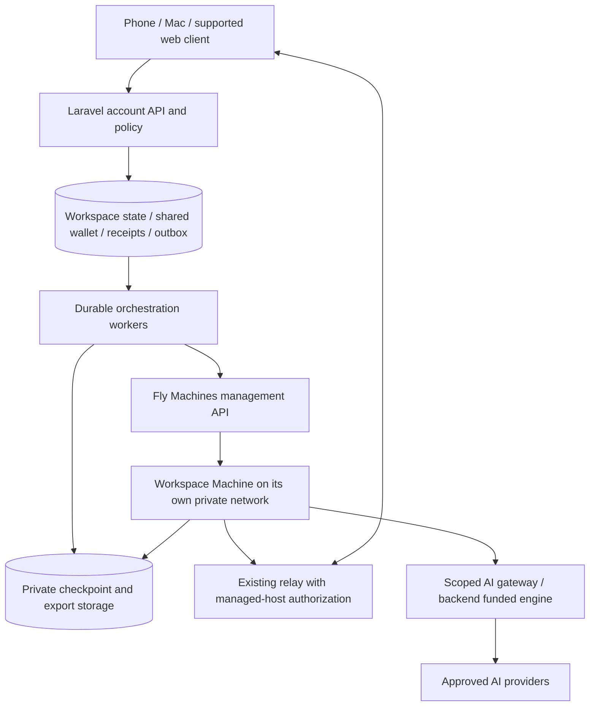
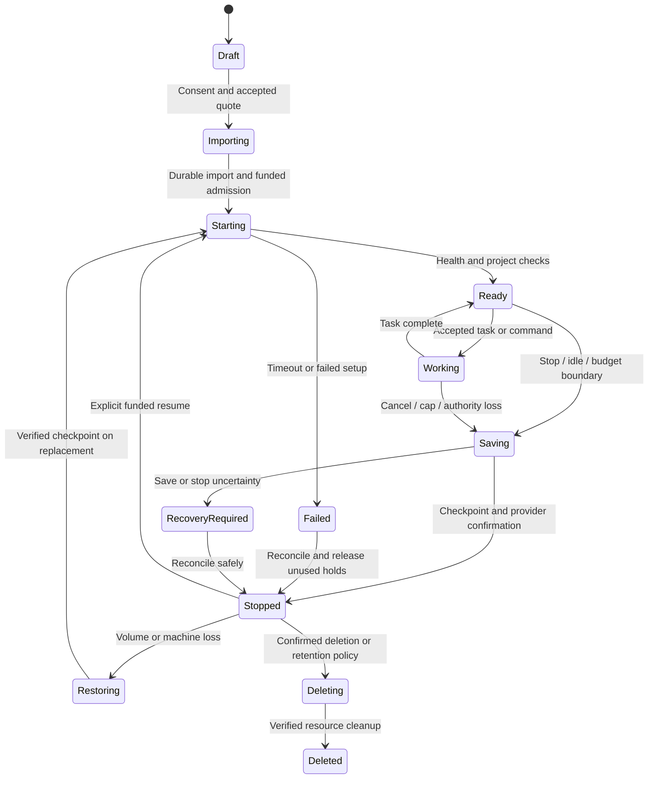

# Vibyra hosted coding workspaces on Fly Machines

**Status:** implementation reference. Prepared 29 September 2026; implementation authorized 30 September 2026. Source delivery, evidence, bounded pilot differences and owner setup are recorded in [cloud-workspaces-deployment.md](cloud-workspaces-deployment.md). Infrastructure, tariffs and production availability have not been enabled. Proposed defaults require the release gates below; they are not existing product promises.

## 1. Outcome and boundaries

Let a signed-in user copy a supported project into a hosted Linux workspace, close or disconnect their Mac, and continue coding from Vibyra on their phone. The hosted workspace executes commands, runs supported agents, serves authenticated previews and saves changes independently of the Mac. When the Mac returns, the user reviews and applies those changes.

Keep two explicit destinations throughout the product:

| Destination | Execution location | Works while an undocked Mac sleeps? | Funding |
|---|---|---|---|
| On my Mac | The user's actual Mac | No | Existing local/relay rules and selected AI funding |
| In the cloud | A Vibyra-managed Fly Machine | Yes, within the accepted budget and runtime limits | Pro entitlement plus metered runtime; Vibyra-funded AI is a separate line item |

The current Cloud relay forwards traffic to an awake Mac. Hosted execution is a new capability. It does not remotely wake the Mac, use its keychain, keep its local processes alive, or provide its native iOS Simulator. Closing a Mac lid must not be necessary for activating hosted work, and no power setting should change as a side effect.

MVP supports a declared Linux toolchain, repository files, a terminal, supported Vibyra-funded agent tools, tests and authenticated web previews. Native macOS builds, Xcode, iOS Simulator, GPU workloads, arbitrary privileged containers and unsupported architectures are outside MVP. Identify compatibility before import. A future macOS runner would need its own provider, licensing, pricing and security plan.

A transfer starts from a saved file snapshot; a running local terminal or agent is not moved live. Unsupported sessions remain available locally. Cloud conversations may import permitted context with provenance, but do not imply recovery of an existing CLI process or its credentials.

## 2. Reviewed baseline and prerequisites

Use these source contracts as the implementation starting point, then recheck the actual deployment before enabling anything:

| Area | Present source behavior | Work needed |
|---|---|---|
| Remote access | Account/device ownership, explicit host approval, scoped grants, signed short host leases and Noise transport | A separately authorized managed-host enrollment policy; preserve physical Mac and nearby pairing rules |
| Membership | Versioned Pro offer in `backend/config/membership.php`: £19.99/month + 300 tokens; £199.99/year + 3,600 upfront; 14-day trial without a token grant | Hosted entitlement and bounded resource limits, independently flagged; verify deployed version and eligibility |
| Token wallet | Version 2 uses 10,000 integer units per Vibyra token; legacy accounts have a different unit scale | Compatible hosted readers/writers, shared AI/runtime reservations, exact unit handling |
| Holds | `Vibes/Wallet.php` reports unsettled `vibes_turns.reserved` | Include hosted holds without inventing fake AI turns or double-counting migrated reservations |
| Funded terminals | Existing backend-funded turns, project consent, model/source bindings, budgets, receipts | Hosted tool capability/version and cumulative AI + compute limits; preserve local no-charge session creation |
| Runtime deployment | Railway backend and existing hosted demo deployment abstractions | A separate Fly coding-workspace provider; do not migrate the backend or conflate demos with coding |
| Project files | Host project identity, snapshots, scoped file tools and approvals | Verified import, durable hosted mutations, checkpoint/export and safe three-way apply |
| Economics | Existing membership analysis | Reconcile `docs/analysis/membership-economics.py` annual input (£219.99) with current config (£199.99) before relying on its results |

Existing paid-token and legacy subscription obligations remain intact. Paid tokens do not expire; promotional grants have their own expiry. Trial access does not imply free hosted compute. Modern enrollment/sales and funded-terminal rollout have separate flags and dated evidence; neither proves this feature is live. Review the latest relay remediation evidence in `docs/cloud/` before integrating, without claiming its tests cover hosted execution.

Source references: `Vibyra/_ai/Vibyra Cloud.md`, `Vibyra/_ai/Backend/Billing Credits And Levels.md`, `Vibyra/_ai/Backend/Backend Platform Architecture.md`, `docs/ios-funded-terminals.md`, `docs/security/remote-access/architecture.md`, `docs/security/remote-access/api-contract.md`, `docs/membership-v2-rollout.md`.

## 3. Architecture

Laravel remains authoritative for ownership, membership, budget admission, permissions, resource state and monetary records. Durable jobs perform provisioning and cleanup; request handlers never wait through a full VM boot or a long provider request. Use a transactional outbox, deduplicated inbox and a reconciliation scheduler. Provisioning, renewal, stop and deletion jobs need dedicated worker capacity so normal account requests remain responsive. Choose a production-supported queue arrangement before launch; adding Redis is a separate prerequisite, not an assumed deployed dependency.

Add a focused `CloudWorkspaces` backend domain and a `CloudWorkspaceProvider` interface for create/start/inspect/stop/destroy/restore. Implement Fly behind this interface with bounded retries, typed outcomes and provider request IDs. Do not reuse demo publishing semantics for arbitrary coding machines. Separate billing, lifecycle, project artifacts, consent and provider code rather than a controller doing everything.

The hosted Host reuses proven transport, project identities and events where appropriate. Its backend implementation must allowlist RPCs and capabilities. Do not reuse a standalone unrestricted shell policy for internet-hosted user projects. Build small files following the repository's first-party source limits and existing context/module conventions.

### Fly layout and isolation

Proposed initial shape: `performance-2x`, 4 GiB RAM, a bounded persistent project disk and an immutable Linux image. Benchmark before confirming this tier. Fly shared CPUs have a lower sustained baseline, so equal vCPU counts do not establish equivalent build performance. [Fly CPU performance](https://docs.fly.io/machines/cpu-performance/).

Use a dedicated production workspace organization, a separate staging organization, and one app/custom private network per workspace. Fly's default organization network lets apps communicate with each other; assign the custom network when creating the app, since it cannot be changed later. Do not allocate a public workspace IP or expose unauthenticated project ports. [Custom private networks](https://docs.fly.io/networking/custom-private-networks/).

Keep central provisioning credentials solely in the orchestration service. Use the least scope and lifetime practical for management operations; an org-scoped provisioner belongs only to the dedicated workspace organization. No Fly credential, master AI key, Stripe secret, signing key or object-store master key enters a user workspace. Fly supports scoped tokens; validate the exact permissions needed by the adapter. [Fly access tokens](https://docs.fly.io/security/tokens/).

Bootstrap each managed Host with a one-use, expiring capability bound to its provisioning operation, owner, machine and generation. Register a distinct Host transport key through the trusted control path; never reuse a Mac's private key. Validate the machine against the orchestrator's provider records instead of trusting a guest-supplied identity. Protect supervisor credentials from the project user, rotate them on replacement and revoke the old generation. Do not assume Fly supplies an attestation feature until the exact integration is verified.

Workspace outbound networking must support ordinary dependency downloads while denying access to other tenants, control-plane private addresses, metadata services and credentials. Check IPv4, IPv6, DNS rebinding, redirects and preview proxy SSRF. A custom network alone does not authorize access to publicly exposed services. Do not bridge all tenant networks into the control-plane network. Use authenticated outbound connections and per-workspace limited artifact/AI capabilities.

Enforce network restrictions outside the untrusted project process and verify that shell code cannot remove them. If the provider/network design cannot enforce a required boundary, solve that prerequisite before permitting arbitrary commands; a tool-level URL check alone is insufficient.

Use a non-root project user, a restricted supervisor, process/memory/disk/PID limits, no Docker socket, no privileged nesting, protected control files and pinned image digests. Verify boundary enforcement against a malicious shell, not only agent tools. Code execution is intentionally powerful inside its workspace; it must not escape into the account, service or another project.

Fly documents Firecracker isolation and security controls, but those are provider properties, not proof of Vibyra's integration. Obtain relevant assurance reports, review incident/support arrangements and run our own isolation tests before release. [Fly security](https://docs.fly.io/security/security-at-fly-io/).

### Image and toolchain

Pin the maintained Host, runtime versions and base image. Include the minimal supported Git, shell and Node/Python tooling; document the initial compatibility matrix. Add other toolchains only after measured support. Separate user dependencies/caches from durable source data. Build an SBOM, scan images, sign provenance, patch critical vulnerabilities and keep a known-good previous image for new-workspace rollback.

Repository manifests and install/build commands can execute arbitrary code. Show project setup consent before running them. Do not automatically execute `.env`, imported scripts or project agent instructions during discovery. A selected command permission can cover bounded setup commands; credential use and publishing remain distinct approvals.

## 4. User experience and authorization

1. User selects **Run in the cloud** for a supported project, or imports an accessible repository from the phone.
2. Show Linux compatibility, destination region, files/exclusions, runtime token rate, AI funding/model, combined maximum spend and background duration. A quote must identify both costs and disclose retained-storage limits.
3. User authorizes project upload, managed workspace creation and spend. Creating an ordinary local funded session stays free; allocating a hosted computer is explicitly metered.
4. Import completes and is verified before the Mac is no longer needed. Show **Saved in cloud — safe to close your Mac** only after durable import acknowledgment and workspace readiness.
5. The phone can start a fresh cloud task with the Mac asleep. Show **Cloud workspace**, active task, remaining cap, runtime spend, AI spend and save status. Reconnecting a viewer does not allocate another machine or another charge.
6. **Stop computer** checkpoints and stops runtime. **Cancel task** ends the task but does not ambiguously imply the computer has stopped. Show any short drain/stop state. **Continue** requires an explicit funded resume if stopped.
7. A sleeping or disconnected phone does not cancel accepted background work. Work continues within the authorized cap/deadline. Inactivity may stop an idle workspace after saving; merely keeping a terminal viewer open is not productive work.
8. When the Mac returns, offer **Review cloud changes** with a diff, conflicts and a reversible apply operation. Keep the cloud copy until apply/export is confirmed.

Reuse existing simple menus, transcript approvals and status indicators. Add clear empty, starting, saving, stopped, out-of-tokens, incompatible, provider-unavailable, restoring and deleted states. Avoid implying physical Mac availability through a cloud workspace badge. Support screen readers, both themes, narrow layouts and consistent terminology across mobile and desktop. Web support must be declared after its existing authenticated transport is verified; a demo website is not automatically a full coding client.

### Managed-host permissions

Define a new managed-host policy version and `hostKind`; do not fabricate an approval from a sleeping Mac. Enroll with strong account authentication, proof of the connecting device and explicit user consent. Preserve registered-device possession, freshness requirements for sensitive authorization, ownership generation, narrowly scoped signed grants and expiring leases. Guests cannot create or connect to hosted workspaces in MVP.

Separate these authorities:

| Authority | Required behavior |
|---|---|
| Workspace ownership | Account-bound; cannot be chosen by a client-supplied user ID |
| Viewer connection | Scoped, short-lived, renewable while authorized; no spend implied |
| Runtime spend | Explicit cap, tariff and deadline; only server admission can renew |
| File read/edit | Bound to selected workspace/project, preserving consent and approvals |
| Shell execution | Explicit capability, bounded to the project runtime; task instructions cannot grant it |
| Secrets / external repository access | Explicit per-secret, per-repository authorization |
| Push / publish / delete | Separate reviewable action; no automatic external publication |

Revoking workspace authority invalidates connections and AI/artifact capabilities and begins shutdown. Logging out a phone revokes that client's access; it need not stop an already authorized background task. Account suspension, ownership changes, disputes and pending refunds block renewal according to policy. Offline clients cannot promise immediate remote shutdown; display the server's confirmed state and lease deadline.

The relay may remain blind to encrypted traffic, but the execution host necessarily processes source and secrets. Do not claim the hosted computer is unable to read them. Disclose Fly and any relevant storage/AI subprocessors and the difference from a local Mac.

## 5. Machine lifecycle, background work and idle policy

Persist desired state separately from observed provider state. Every transition has a workspace generation, operation ID and expected revision. At most one active machine can write a workspace generation. Use provider resource metadata to reconcile resources after timeout; never assume a timed-out create failed and blindly create a second billable machine. Capacity errors retry with a bounded delay, then offer a region choice with a fresh quote and explicit data-region consent. [Machines API](https://docs.fly.io/machines/api/).

Disable request-triggered autostart for the managed MVP. An incoming viewer/preview request must never bypass spend admission. Use Vibyra's controller to start and stop. Fly Proxy's traffic-based idle mechanisms cannot serve as the source of truth for an agent working without a connected phone. [Autostop and autostart](https://docs.fly.io/launch/autostop-autostart/).

Proposed pilot defaults, to validate and configure rather than hard-code:

| Setting | Proposed starting point |
|---|---|
| Concurrent running workspaces | 1 per account; global cohort/concurrency limit |
| Standard hardware | Performance 2 vCPU / 4 GiB; resize requires a new quote |
| Project disk | Up to 20 GiB provisioned disk; source/export upload quotas separately enforced |
| Idle grace | 5 minutes without an accepted task, command, active setup or authorized preview activity |
| Background deadline | User-selected; initial maximum 8 hours per authorization |
| Runtime authorization | Short renewable compute leases; candidate 30-second lease, 10-second renewal, at least 60 seconds funded runway |
| Retention | Candidate 7 days stopped disk, then verified archive; 30 days archive with advance notice/export |
| Auto-refill or automatic cap increase | Off; explicit separate opt-in only if later introduced |

A preview-only session needs a clear active-use policy and visible cost; do not let WebSocket pings or hidden browser tabs maintain paid runtime indefinitely. Long tests and approved build/install commands count as work even with no output. A supervisor distinguishes these from stale sockets. Enforce wall-clock deadlines, output quotas and runaway process termination.

Pilot scope is one active coding task per workspace, plus explicitly approved supporting services. Multiple terminal viewers do not create multiple runtime charges. Attribute the single compute timeline consistently to the active task or idle workspace so overlapping services cannot double-bill or bypass a task cap.

The supervisor rejects new work as its signed compute authority nears expiry and safely interrupts/checkpoints before that deadline. A separate controller also stops the Machine through the provider API, because guest code or a compromised guest cannot be trusted to report honest usage or enforce a bill. Use server/provider state for metering, not client heartbeats or shell-supplied counters. Validate stop lead time under load.

If provider control is unavailable, deny renewals and trigger operator alarms/emergency cleanup. Vibyra absorbs costs beyond the authorized customer boundary. Do not release holds covering an unresolved interval prematurely, and do not charge customers indefinitely for an unconfirmed provider stop. A machine continuing during a provider outage is an operator risk that needs a bounded global contingency budget.

Membership lapse blocks new work and lease renewal, then saves/stops active work. Allow read/export and billing history according to retention policy. Feature disablement likewise preserves export and settlement; it must not make paid data inaccessible.

## 6. Token economy: one wallet, separately itemized costs

### Meaning of a token

Use the existing Vibyra token wallet. A Vibyra token is a product billing unit, not an LLM input/output token. Version 2 has **10,000 integer ledger units per Vibyra token**. Current AI cost accounting maps one unit to one micro-USD of metered value. Retail GBP purchase prices, USD provider invoices and this metering convention are different quantities. Do not silently redefine existing paid balances to fund a new tariff.

Require a documented compatible runtime pricing policy before implementation. If runtime uses the same unit-value convention, include any approved overhead/margin in a versioned runtime tariff rather than changing `unitScale`. Quote and store that tariff exactly. If commercial policy needs a different economic meaning, use an explicit reviewed version/migration rather than an implicit multiplier hidden in UI.

### Membership and included value

Recommended offer: Pro unlocks the hosted capability; actual runtime consumes tokens. Vibyra-funded AI consumes tokens separately. The existing 300 monthly tokens are a wallet grant, not unlimited compute, a new extra compute grant or a promise of 300 hours. Paid top-ups remain usable under their existing terms.

Do not add unlimited hosted computers to an entitlement called unlimited terminals. A trial without tokens needs a paid balance or a specifically approved, capped promotional cloud grant. Free/legacy access, annual grants, Apple subscription status and any billing grace period must be mapped explicitly. No implicit complimentary runtime. Any future included hours require a separate liability/economics review.

Pilot proposal: runtime and AI share paid balances; admit promotional spending only for grant types explicitly enabled after abuse and recurring-cost review. Preserve existing eligible AI promotional use. Do not accidentally permit a Free pilot cohort to provision cloud machines through an AI entitlement. Show any source restriction before spending.

### Shared reservation substrate

All AI and cloud writers must use the same wallet row lock and grant allocation rules. Add a common reservation abstraction, or an additive cloud reservation table integrated through a common allocation service. Keep current turn IDs and compatibility readers. Do not duplicate an existing AI hold into a second table without an atomic bridge and an audited backfill.

Required invariants:

- Available spendable units never become negative. A grant unit is available, held or charged, never two at once.
- AI holds, compute runway holds and storage holds if introduced are visible in the same snapshot and in account/project/session spend-cap calculations.
- Reserve against unrevoked eligible grants under a transaction, respecting expiry/order, disputes, pending refunds, plan rules and global risk budgets.
- Two devices starting work, another AI turn, a top-up, expiry and a refund cannot concurrently overspend the same units.
- Customer charged amount cannot exceed the accepted reservation/cap; actual provider expense may exceed it only as operator-absorbed cost.
- Settlement and release are idempotent. Replaying provider events, queue jobs or API requests cannot mint or debit tokens twice.
- Partial settlement and renewal cannot reset the cumulative session cap. Restarts and region recovery do not grant a fresh allowance.
- Money-related APIs preserve exact integer strings, `unitScale`, account scope and monotonic snapshot revision; no floating-point ledger arithmetic.

Define durable reservation states (`reserved`, `partially_settled`, `settled`, `released`, `reconciliation_required`) with immutable allocation records. Use unique references for account + operation + generation + billable interval. Track paid/promotional provenance so unused holds return to the original grant according to existing expiry/revocation rules. Expired promotional value is not converted into fresh paid value when released. A refund blocks new spend and reconciles held allocations before revoking refundable grants.

Update `Vibes/Wallet.php`, `Membership/Snapshot.php`, all quote/admission/settlement paths, refund/dispute handling, usage windows and UI readers together. Legacy wallets must either have an explicit compatible path or fail with a helpful upgrade/eligibility message. Enabling a v2 runtime writer against an unreviewed v1 reader is a release blocker.

### Compute quote, start, settlement and stop

1. Issue an expiring server quote binding owner, workspace/project, region, shape, tariff version, unit scale, maximum spend, background deadline and expected wallet revision.
2. Accept with an idempotency key and immutable payload digest. Atomically reserve initial runtime runway and any admitted first AI turn. A changed payload with the same key fails.
3. Provision asynchronously. Customer runtime begins only at the defined, server-recorded ready boundary. Initial boot failure, provider capacity retries and Vibyra-caused restoration overhead are operator costs. User-authorized setup after readiness is billable and disclosed.
4. Settle non-overlapping ready-to-stop intervals and reserve the next runway under the same lock. Carry fractional tariff arithmetic between intervals and round once at the agreed settlement boundary; retry timing must not increase rounding charges.
5. Before admitting an AI request or a long command, check remaining combined cap and shutdown runway. If insufficient, checkpoint and stop, with no automatic top-up or more expensive fallback.
6. On stop, close new admission, cancel or drain within the authorized budget, checkpoint, confirm provider state and settle the authorized interval. Release unused holds only after interval reconciliation. Stop cannot depend on the phone remaining connected.

Tariff is a rational integer number of units per second with a named billable state and no hidden minimum. A future minimum, premium region or hardware upgrade requires a new quote. Record timestamps, source of truth and uncertainty bounds; do not charge the same seconds as both idle and active intervals.

An accepted tariff remains fixed through its authorized session deadline. A later provider price change is operator exposure until a new user-approved quote, rather than an invisible increase during background work.

Suggested cap model: account daily/monthly total, workspace lifetime total, task/session total and one-turn AI cap. Admit only when **settled spend + outstanding commitments + proposed commitment** fits every applicable cap. Compute runway counts alongside AI reservations. Budget increases require an explicit confirmation and a new revision; low balance never switches funding sources silently.

### Vibyra-funded AI accounting

Use the existing backend-funded engine or a verified provider adapter through a scoped gateway. The workspace never receives the service's AI master key. Each call binds workspace, generation, task, model, funding source, tool capability and reservation. Enforce maximum output, context/tool schema size, timeout, attempts and cumulative tool-loop spend before making a call.

Record provider input, output, cached input, reasoning and other billed categories supported by that adapter, including its price version and request ID. Provider-native usage counts are evidence for cost, not Vibyra token units. Preserve actual cost, customer debit, reserved amount, absorbed cost and uncertain exposure as separate fields. If an adapter cannot reliably quote and reconcile usage, keep it disabled.

Unknown outcomes must not be treated as free or retried blindly. Persist request intent before dispatch, then reconcile cancellation/timeouts using provider evidence. Hold a bounded uncertainty reserve, apply existing risk rules and block runaway retries. Settle within accepted bounds; invoice discrepancies above the accepted quote belong to Vibyra, not a retroactive customer debit. Do not double-charge streamed chunks or agent tool events as additional AI requests.

Preserve the current unusable-answer absorption policy where applicable. Valid workspace runtime may still be incurred while an AI request fails; explain the distinct lines and define a fair operator-fault policy before release. AI execution on Laravel must not also be billed as another Fly AI compute charge beyond the displayed workspace runtime.

Classifiers, Auto routing, summarization, embeddings, image work and other supporting model calls need explicit operator/customer cost ownership. Existing session creation remains uncharged where promised. Auto must stay inside the user's model/funding/cap choices and preserve provenance; no unquoted premium-model selection.

### Own-provider accounts and genuine CLI support

Keep hosted personal-account mode behind a separate feasibility gate. A local Codex or Claude login does not prove its credentials can legally or safely be transferred to a hosted machine. Never copy Mac keychain entries, credential folders or subscription sessions automatically. Research the exact current provider-supported authentication and terms before implementing each adapter.

Recommended first release is verified Vibyra-funded hosted agent execution. Advertise an actual Codex/Claude CLI mode only after testing the real CLI, its supported hosted authentication, behavior, permission model, cancellation and usage receipts. Do not label a generic funded chat engine as a stock CLI. A ChatGPT/Claude subscription is not automatically API credit; subscriptions and APIs need distinct eligibility and charging descriptions.

For a later supported own-provider mode: obtain explicit credential authorization, encrypt the minimum secret, scope it to the workspace/task, permit revocation and deletion, show who pays AI, and keep Vibyra runtime billing. Do not apply a second Vibyra AI debit when the user directly pays that provider. When quota/auth fails, pause and ask the user to choose a permitted funding change with a fresh quote; no automatic Vibyra-token fallback. Provider charges incurred outside our gateway are not guaranteed by our wallet cap, so clearly describe that boundary before enabling the mode.

### Storage and other resource costs

MVP proposal: include a bounded stopped-workspace storage/archive allowance in Pro rather than continuously draining tokens while the user is away. Meter running runtime and AI only. This requires strict per-account quotas, a disclosed retention policy and storage funding in the economics model. New persistent storage tiers, always-on services or higher bandwidth limits need their own explicit tariff and consent; no surprise storage debit.

Retention timers pause or otherwise provide a safe export remedy during Vibyra outages. Warn before archive/deletion through authorized product notification surfaces. Paid token non-expiry does not imply perpetual project storage, so communicate these separately. Never delete unsettled recovery data or the last checkpoint while presenting it as saved.

### Illustrative combined receipt

**Arithmetic example only; not a proposed production price:** runtime tariff 12 tokens/hour, 30-minute session, actual AI settlement 2 tokens, and an accepted combined cap of 10 tokens. Runtime is 6 tokens; AI is 2; total charged is 8. Any unused reservation is released to its original grant according to grant rules. The screen displays both lines, the 8-token total and remaining cap of 2 tokens. Changing device, reconnecting or replaying Stop adds no charge.

Show this detail in quote, live usage and receipt: runtime state/shape/region/time/rate/version; AI model and usage/cost; original balance, held amount, charged/released amount; paid/promotional source; cap; stop reason; receipt ID and support reference. A provisional receipt must identify unsettled provider usage and later finalization without silently changing a finalized charge.

## 7. Provider costs and commercial approval

Announced rates effective **1 October 2026** include `performance-2x`/4 GiB at **$0.0917/hour**, or approximately **$9.17 for 100 running hours**, compute only. Recheck the chosen region before launch. This is a provider reference, not our customer tariff. [Fly pricing update](https://fly.io/pricing-update/).

| Published cost reference | Planning treatment |
|---|---|
| Provisioned volume $0.15/GiB/month | 20 GiB costs about $3/month |
| Snapshot $0.08/GiB/month; first 10 GiB free | Check organization allowance and retained bytes |
| Stopped root filesystem $0.15/GiB/month | Minimize roots; test archive/restore |
| North America/Europe egress $0.02/GiB | Measure traffic; check other regions |
| Dedicated IPv4 $2/month | Avoid per-workspace public IPs |

Storage/network references: [Fly pricing update](https://fly.io/pricing-update/). Thus 100 running hours + 20 GiB provisioned volume is about $12.17 before snapshots, archives, networking, backend, AI, support or tax. Validate currency/account terms and persistent costs after stop; token pricing must cover the complete model.

Prepare a versioned economics worksheet using actual approved membership prices and top-ups. It must include:

- Running seconds, idle/drain time, boot/failed-start/restore overhead absorbed by Vibyra and orphan/outage exposure.
- Volumes, stopped roots, snapshot deltas, independent archive objects, requests, egress, preview bandwidth and dependency downloads.
- AI actual spend, estimation/uncertainty losses, supporting model calls and provider invoice reconciliation.
- Control plane, durable workers, database/cache, relay capacity, observability, secrets/KMS, support and abuse/security overhead.
- GBP/USD assumptions, VAT/tax treatment, Stripe/Apple/platform fees, refunds, chargebacks and promotions.
- Monthly and annual full grant redemption, annual upfront grant bursts, top-up mix, legacy obligations and dormant-user storage.
- Concurrent-user peaks, available machine capacity, hardware performance and cost per completed build/task rather than vCPU labels alone.
- A bounded operator risk reserve and healthy margin under high utilization, not only average use.

Approve runtime tariff, included storage allowance, promotion eligibility, hardware/region menu, account caps, global provider/AI spend caps and pilot budget together. Set alerts below those caps. Provider invoice export should reconcile daily metered resources and AI receipts, with an operator review queue for mismatches. Never let a provider's best-effort budget alert substitute for admission control.

## 8. Project import, durability and return to Mac

### Import

Capture repository identity, base commit when present, normalized root, project identity, snapshot hash and file manifest. Include dirty/untracked source after the user reviews exclusions. Preserve binary files, executable bits, permitted symlinks and case information. Warn on Linux case sensitivity or unsupported file names. Do not upload keychain data, credentials, `.env` secrets or caches by default. Give an explicit reviewed path for required secrets.

Enforce file count, individual size, total bytes and disk quotas. Use resumable chunks with checksums and account-scoped expiring capabilities. Reject path traversal, absolute paths, symlink escapes, archive bombs and mount/control-directory overwrites. Imports become visible atomically only after verification. An import hash cannot reveal another account's private object through a global deduplication lookup.

From-phone repository import needs supported explicit authentication and a bounded clone path. From-Mac import requires the Mac online until acknowledgment. A sleeping Mac's unuploaded files are unavailable. Read-only discovery does not run repository hooks; Git credentials and hook execution need their own controls.

### Durable storage

Put source, worktree changes and appropriate session state on the project volume; treat machine root and tool caches as replaceable. Fly volumes are local, single-attached and not automatically replicated. Daily snapshots are not a sufficient primary backup for this product. [Fly volumes](https://docs.fly.io/volumes/overview/).

Add independent private object-storage checkpoints with a manifest, checksums, schema version and workspace generation. Provider snapshots are an additional recovery layer. Preserve uncommitted changes, binary files and modes. Exclude ordinary build caches; decide explicitly whether essential database/application state is supported and backed up or warn that it is ephemeral.

Design target: edits acknowledged as **Saved in cloud** are durably recoverable outside the machine's failure domain. Either checkpoint those mutations before that acknowledgment or use a distinct **Saving** state until they reach the independent store. For arbitrary shell writes, checkpoint at most every 60 seconds during activity and label the pending window; a volume write alone does not meet a zero-loss acknowledgment promise. On graceful stop/export, wait for the latest verified checkpoint.

Proposed recovery objectives: no loss of acknowledged independent checkpoints; up to 60 seconds of unacknowledged shell writes under sudden host loss; restore a standard pilot project within 10 minutes when provider capacity is available. Measure these before promising them. Do not claim zero downtime or automatic multi-region high availability. Region changes need privacy review and user consent.

Encrypt transport and stored artifacts, scope access by owner/project/generation, and isolate backup signing from untrusted guest code. Checkpoint manifests must be validated by trusted storage/control services; a compromised workspace cannot overwrite another workspace's history. Keep append-only versioned objects until authorized retention cleanup. Regularly test restores to a different machine/volume and verify hashes.

### Return and conflict handling

Store base snapshot B, current Mac tree M and hosted tree C. Present a three-way comparison B→M and B→C. Apply non-conflicting changes only after review, preserving local changes. Show conflicting edits, renames, deletes, file modes and binaries explicitly. Never overwrite a project because it shares a name with the cloud copy.

Before apply, verify current project/root/account identity and a fresh local revision; take a local reversible backup or branch/worktree as appropriate. If files change during review, recalculate. If the local directory moved, ask for the correct target rather than writing to a guessed path. Commit/push, external deployment and secret transfer remain separate user-approved actions. Applying a cloud diff does not automatically run its scripts.

Provide a verified downloadable archive/patch even if the Mac app is unavailable. Losing Pro access, disabling cloud creation or a provider outage must not remove access to retained exports. Do not auto-delete the cloud copy just because export began; require acknowledgment or the disclosed retention process.

## 9. Durable records and API contracts

The following names/routes are proposed, not existing endpoints. Final migrations should be additive and reviewed against actual production tables.

| Record | Essential fields/invariants |
|---|---|
| Workspace | Owner, project identity, host kind, region/shape, policy version, desired/observed states, generation, image digest, archive/retention status, optimistic revision |
| Provider resource | Workspace/generation, app/network/machine/volume IDs, operation ID, health timestamps, labels, cleanup status; uniqueness prevents duplicate active generations |
| Authorization | Device/user proof, permission scopes, consent versions, max budget, deadline, revocation and generation |
| Runtime tariff and quote | Immutable version/rational rate, supported shape/region, unit scale, expiry, payload digest, wallet revision and inclusions |
| Shared reservation/allocation | Owner, spend kind, source grants, held/charged/released units, idempotency reference, cap binding, uncertainty and state |
| Runtime usage interval | Non-overlapping server interval, billable boundaries, provider evidence, signed lease reference, tariff, cost/debit/absorbed amount |
| AI call/turn | Existing compatible IDs plus workspace/task/generation binding, funding/model, request ID, native usage, price version, reservation and reconciliation status |
| Task/session | Immutable funding/model/tool binding, state, cumulative commitments/spend, command permission, deadline, event cursor |
| Project checkpoint/import/export | Base revision, manifest hash, object versions, verified timestamps, excluded secrets, pending state and retention |
| Audit/outbox/inbox | Unique event ID, actor/action, expected generation/revision, redacted metadata, delivery/retry status |

Suggested API surface under `/api/cloud-workspaces`:

- List/get workspace metadata and compatible capabilities without allocating resources.
- Quote creation/resume/resize; create draft/import; resumable upload authorization/finalize.
- Start/resume, stop, cancel task, explicitly increase budget and submit a funded task.
- Issue managed-host connection grants after ownership/device/scope checks.
- Read authoritative wallet/usage/receipt snapshots and replay cursor-based task events.
- Request/list/download exports; review apply metadata; revoke authority; archive/delete with confirmation.

Mutations require authenticated ownership, strict input allowlists, appropriate device proof, CSRF protections where relevant, idempotency keys and expected revisions. A client cannot supply trusted price, usage, grant balance, provider resource owner or permission expansion. Expiring quotes cannot be replayed for another account/region/hardware. Rate limit creation, uploads, grants, starts and expensive polls; signed download URLs expire and must not be logged.

Events have monotonic cursors and stable IDs; reconnect recovers authoritative state, not a second turn. Task acceptance persists before execution. Viewers can attach to accepted tasks from another permitted device. Transport reconnect and signed connection lease renewal are separate from compute admission. Preview tickets bind workspace/generation/port/scope and cannot start a stopped computer without explicit spend consent.

Persist command intent, execution ID and completion evidence before acknowledging success. Queue redelivery reconnects to known execution instead of rerunning it. After a crash with an ambiguous shell/external side effect, report an unknown outcome and require inspection or explicit retry; do not promise exactly-once arbitrary commands or silently replay a publish/push.

## 10. Privacy, secrets, abuse and compliance

Store only secrets deliberately selected for hosted use. Prefer short-lived credentials; encrypt at rest with separate keys, redact logs, scope environment injection and delete on revocation/retention cleanup. Prevent terminal output and file content from entering ordinary analytics. Offer an audit-visible support access process with minimal scope; operator debugging cannot become an undocumented back door.

Inject managed credentials into protected ephemeral storage where practical. Specify whether customer-created secret files enter checkpoints and how backup retention/key deletion affects them; never promise immediate erasure from all backups without a verified deletion design. Strip service capabilities from exports and block accidental inclusion of supervisor/runtime credentials.

Specify data regions, processors, retention, backup deletion delay, account deletion and incident notification. Provide export before normal deletion; delete machines, volumes, artifacts, temporary credentials and provider resources under an auditable retryable workflow. Keep necessary billing/audit records according to approved policy without retaining source unnecessarily. Avoid logging prompts or project content by default.

Apply creation/concurrency/network quotas, anomaly detection and graduated suspensions against mining, spam, scanners, malware, API abuse and token-farming. A valid Pro payment is not a security boundary. Suppress abandoned-resource spend through reconciled teardown and notify operators of suspicious egress or cross-tenant attempts. No hidden access to customer code to satisfy abuse monitoring; define its legal and product basis explicitly.

Review digital-service payments on each surface with current store rules. Reuse the maintained Apple purchase/restore integration for applicable iPhone token sales and Stripe for authorized web/Mac flows. Do not silently add an iPhone external-checkout route or bypass policy. Verify how runtime redemption and non-expiring paid credits are described, restore/refund behavior, privacy disclosures and App Review notes. [Apple review guidelines](https://developer.apple.com/app-store/review/guidelines/).

## 11. Failure handling and support rules

| Event | Required result |
|---|---|
| Phone disconnects or sleeps | Accepted task continues within cap/deadline; viewer can resume |
| Mac sleeps after verified import | Cloud accepts a new task; original Mac shows offline separately |
| Mac sleeps during incomplete import | Import pauses/fails clearly; no claim files were saved |
| Insufficient balance before start | No billable workspace start; show required reserve and available balance |
| Balance runs low during task | Deny new AI/tool spend, preserve shutdown runway, save/stop with a clear reason |
| AI call response/usage is uncertain | Bounded hold and reconciliation; no blind duplicate request |
| Database/queue/control-plane outage | Existing finite authority expires; no new spend; emergency controller/recovery reconciles |
| Provider create timeout | Inspect by operation metadata before retrying; no duplicate computer |
| Stop API timeout | Show stopping/uncertain; retry boundedly, fence admission, operator escalation; cap customer charge |
| Machine/volume loss | Restore verified checkpoint with new generation; fence old writer; operator pays restore overhead |
| Checkpoint failure or full disk | Display unsaved state; prevent risky new mutations, retain available data and stop safely |
| Two devices submit the same action | One durable task, one reservation and one receipt |
| Old device/account switches during work | Old-account data cleared locally; server grants cannot cross ownership |
| Refund/dispute/subscription lapse | Block new admission, settle held work consistently, preserve permitted export |
| Delete races with running task | Revoke admission and connections, stop/fence, settle, then delete resources |
| Deployment or feature rollback | Disable starts while keeping stop/export/settlement and old receipts working |

Support can inspect redacted operation/receipt IDs and confirmed state. Define runbooks for orphan resources, failed stops, price/invoice discrepancies, lost volume restore, compromised workspace, account deletion and refunds. Correct charging errors through auditable adjustments, not direct database edits or untracked token grants.

## 12. Validation matrix and release evidence

Plan-only work does not execute these tests or create resources. During implementation, tests must prove behavior rather than mirror helpers; real PostgreSQL locking and real provider/native evidence are required for the relevant boundaries.

| Area | Minimum acceptance coverage |
|---|---|
| Wallet concurrency | Parallel AI + runtime holds; two devices; last available unit; overlapping renewal; top-up/refund/expiry races; no negative or duplicated value |
| Unit compatibility | Exact v2 integer strings; legacy behavior; account scope; all held kinds and monotonic revisions; paid/promo source preserved |
| Billing lifecycle | Quote expiry/digest/revision; failed boot; readiness boundary; fractional rounding; partial settlement; duplicate/reordered events; stop/drain; late evidence; no charge above cap |
| AI costs | Native usage categories; cached/reasoning usage; tool-loop bounds; uncertain timeouts; cancellation; retry cost; no funding fallback; unusable answer and operator absorption |
| Authority | No ordinary login-only host approval; wrong account/device/generation; expired/replayed grants; revoked consent; unknown RPC; background task and viewer leases separated |
| Tenant security | Private-network isolation; cross-app/private/public routes; malicious shell; secret/gateway scope; upload traversal and symlinks; IPv6/metadata/preview SSRF |
| Provisioning | Retry after timed-out create; scarce capacity; replacement/stop races; resize/image restart; generation fencing; orphan cleanup and global spend caps |
| Durability | Sudden machine loss; different-volume restore; latest dirty binary/mode files; checkpoint failure; full disk; archive rotation; last-known-good object retained |
| Project return | Dirty Mac changes; rename/delete/conflict; stale review; case mismatch; moved root; corrupted transfer; reversible apply and verified export |
| Background execution | No connected client; long silent build; phone logout; deadline; low balance; active preview; truly idle stop; viewer cannot trigger paid resume |
| Native UX | Physical iPhone cellular; Mac lid closed after import; new prompt/edit/test; budget/receipts; both themes/accessibility; account switching and reconnect |
| Commerce | Stripe/Apple restore/refund; expired/annual/trial/legacy membership; default-off flags; free/promo restrictions; store-facing descriptions |
| Operations | Worker restart; DB outage; Fly API outage; queue backlog; independent emergency stop; invoice reconciliation; delete/restore drills; operator alarms |

Run focused backend feature tests, the isolated PostgreSQL process-race runner (extend `backend/tests/integration/membership-concurrency.php`), Host Rust tests, affected desktop/mobile typechecks and source-size checks. Add targeted fixtures for visible budgets, cloud states and conflicts. Use existing configured verification scripts where applicable and new focused scripts only for gaps. A browser fixture, Simulator transport test or typecheck does not establish physical cellular execution or store acceptance.

Benchmark the same representative projects: cold/warm import, dependency install, build/test, agent edit, preview, memory/disk pressure, stop/start and full restore. Record completed-task time, p50/p95 latency, CPU throttling, failure rate and total cost. Include a heavy repository and a malicious/abusive workload. Compare another provider only if needed; do not assert better hardware solely from price.

Closed-lid acceptance must happen on a physical phone with Wi-Fi off, the Mac on its own network before sleeping, and fresh cloud execution after lid closure. Capture new file hashes, command/test output, cloud host identity and authoritative receipts. Reopen the Mac and review/apply the resulting diff without losing local changes. Previously streamed output or an online indicator is insufficient.

## 13. Implementation sequence

| Phase | Deliverables | Gate before next phase |
|---|---|---|
| 0 — Baseline and policy | Recheck deployed membership/wallet/relay; confirm Linux compatibility and real agent adapters; approve economics inputs, retention, region and pilot limits | Exact source/live baseline; no unresolved authentication or tariff assumptions |
| 1 — Shared accounting | Compatible reservation/ledger extension, cap service, runtime quote, snapshot readers, refund/risk integration; flags off | PostgreSQL races and invariants pass; all readers understand holds; migrations/backfill reversible |
| 2 — Provider and isolated runtime | Fly adapter, dedicated environment, custom network, pinned Host image, lifecycle/outbox/controller, finite leases and orphan cleanup | Synthetic sandbox tests prove isolation, stop behavior, idempotency and measured compute boundary |
| 3 — Durable projects | Verified import, volume layout, independent checkpoints, restore, export and retention jobs | Recover dirty changes after machine/volume loss; no false saved acknowledgment |
| 4 — Funded execution | Explicit hosted capabilities, AI gateway/engine integration, command approvals, per-call receipts, event recovery and cancellation | Actual supported agent edits/runs tests within shared caps; no secret leak or duplicate AI call |
| 5 — Product surfaces | Cloud destination, quote/budget/usage UI, mobile/desktop transport, previews, safe Mac apply and support states | Physical closed-lid cellular flow and conflict/reconnect acceptance; no relay regression |
| 6 — Operational readiness | Dashboards/alerts, invoice matching, deletion/refund/restore/emergency-stop runbooks, security/privacy/store review | Staging soak at least 24 hours plus outage/rollback drills; economics approved using measured costs |
| 7 — Bounded pilot | Invite-only paid cohort, initially up to 10 accounts, controlled concurrent machines and an explicitly approved provider/AI budget | At least 7 days of representative pilot use; cost, reliability, support and recovery thresholds met |
| 8 — General availability | Published tariffs/limits/retention/support; staged cohort rollout and release notes | Final security/commercial/native acceptance; rollback and kill switches remain usable |

Implementation authorization, credentials and any new infrastructure spending must come in a later task. This document records what would be implemented and verified; it does not approve a paid pilot budget or enable a service.

Dependencies matter: shared wallet admission precedes real customer-funded machines; verified durable import precedes a safe-to-close message; supported AI authentication precedes advertising that provider; measured economics precedes published tariffs. Do not ship a shell-and-VM prototype as a billing-complete product.

### Source map and responsibility

Use this narrow starting map; new module names are proposals. Recheck current ownership before editing because the repository already has concurrent work.

| Workstream | Starting source or contract | Responsible role |
|---|---|---|
| Commercial policy | `backend/config/membership.php`, membership plan/rollout docs, economics script | Product owner approves prices, liability, cohort and retention |
| Wallet and cost control | `backend/app/Services/Membership/Units.php`, `backend/app/Services/Membership/Snapshot.php`; `backend/app/Services/Vibes/Wallet.php`, `backend/app/Services/Vibes/Turns.php`, `backend/app/Services/Vibes/TurnPrice.php` | Billing/backend owner implements and reconciles all spend kinds |
| Provisioning and persistence | Backend platform architecture; new `CloudWorkspaces` domain, provider adapter and lifecycle jobs | Runtime/backend owner operates workers, cleanup and restore |
| Hosted engine and RPC | `host/crates/server/src/backend.rs`, `remote_permissions.rs`; engine funded bindings, project snapshots/identity and tools | Host/security owner implements managed capabilities and verifies actual execution |
| Funded API/AI | `backend/app/Jobs/RunVibesTurn.php`, funded-terminal contract and existing agent tools | AI/backend owner proves pricing, auth, receipts and uncertain-outcome handling |
| Native destinations and wallets | Maintained `mobile/`, `desktop-tauri/`; funded workspace hooks/screens and account-owned remote state | Client owners verify quotes, permissions, reconnect, export/apply and physical devices |
| Transport and preview | Remote-access architecture/API contracts and current relay remediation evidence | Remote/security owner verifies managed leases without physical-Mac regressions |
| Operational acceptance | Infrastructure rollout, runbooks, provider invoices and staged flags | Named on-call owner can stop spend, restore projects and handle incidents |

Assign real owners before implementation. One person may hold multiple roles, but commercial approval, operational access and acceptance evidence must be explicit. Track phase dependencies and unresolved decisions in the implementation task, rather than guessing a delivery date before the baseline and adapter feasibility gates pass.

### Rollout and rollback

Use independent default-off flags for hosted entitlement, create/start, funded AI adapters, previews, own-provider auth and UI exposure. Enable settlement, stop, reconciliation and export whenever prior resources exist, even if creation is disabled. Backward-compatible schema/readers land before new writers. Test a restore of the database and project artifacts independently.

Roll out server readers/policies, workers/Host image and client support in a documented compatible order. Old clients cannot submit unsupported capabilities or start a metered computer invisibly. Do not overwrite the deployed canonical backend with an unrelated website worktree. Record exact commit/image/client builds and flag values in acceptance evidence.

Define go/no-go thresholds before the pilot: failed-start rate, p95 ready time, acknowledged data-loss target, restoration time, wallet discrepancies, stop latency, task cost and gross margin. Any cross-tenant access, duplicate/unauthorized debit or acknowledged data loss halts new starts immediately. Disable admission, stop/checkpoint affected work, retain export and reconciled receipts, then investigate. No data-destructive migration is needed to turn off this feature.

## 14. Decisions required before enabling service

Planning recommendation is Fly Machines plus Pro access and separately itemized token-metered compute/AI. These specifics still need an explicit documented decision after measurement:

1. Exact supported project types, toolchains, region(s), hardware and capacity fallback policy.
2. Approved runtime unit mapping/tariff, markup, taxes, included storage and paid/promo eligibility; no unlimited promise.
3. Account/day/month/task caps, background limit, idle policy, retention and pilot/global operator budgets.
4. Common reservation implementation and migration bridge for every existing wallet writer/reader.
5. Managed-host authentication/scopes and which existing clients can connect securely.
6. Working MVP AI adapters, exact funding labels and whether genuine CLI or supported personal-account modes are feasible.
7. Object storage/queue provision, trusted checkpoint acknowledgment and measured recovery objectives.
8. Privacy/store/commercial disclosures, support commitments and owner of each operational runbook.

Keep these in a decision log when approved. Missing decisions should leave their feature flags off; implementation must not substitute arbitrary hard-coded policy.

## 15. Definition of done

The feature is ready only when a user can authorize a supported project and bounded spend, receive a verified durable import, close the Mac, issue a new task from a physical cellular phone, see a real hosted edit and test/preview, and receive separate accurate runtime/AI receipts. The computer must stop on budget/deadline/revocation, preserve recoverable changes across machine loss, and return a reviewable conflict-safe diff to the reopened Mac.

Security isolation, shared-wallet concurrency, unknown-cost handling, invoices, refunds, retention/export, deletion and rollback must pass their acceptance gates. The published offer must be profitable under measured full-redemption assumptions. Features that lack this evidence remain disabled and are described as unavailable rather than partly working.

## Planning review record

- Source/memory review identified hosted execution as a new domain, shared-hold accounting as a prerequisite and the stale annual economics input as a release blocker.
- Provider documentation supports the proposed Machine/network/storage approach; region prices, capacity, enforcement and performance still require implementation-time verification.
- This plan specifies permission boundaries, state persistence, token accounting, failure recovery, project synchronization, testing and staged release; numerical customer tariffs remain deliberately unapproved.
- The original planning task made no runtime changes. The subsequent implementation request delivered the bounded hosted pilot in source; see `cloud-workspaces-deployment.md` for verified checks, supported boundaries and outstanding release work. No live infrastructure, service configuration or new pricing offer has been enabled.
