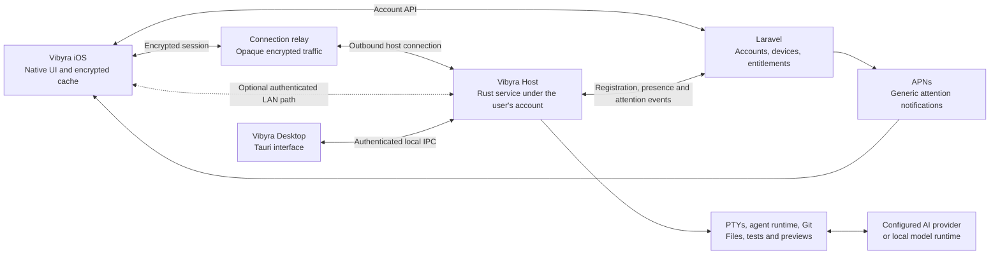

# Vibyra iOS app: software review and delivery plan for 2026–2027

Prepared 5 September 2026. Status: implementation started. The terminal workspace foundation is in development; the roadmap and public-release gates remain open. See [implementation status](ios-mobile-implementation-status.md) for the delivered scope and validation limits.

## Recommendation

Build Vibyra for iPhone as a native-feeling control surface for development running on the user's own computers. Keep the existing Expo/React Native foundation, reuse the Rust execution core, introduce a persistent Vibyra Host service, and connect devices through authenticated, end-to-end encrypted sessions. Use Laravel for accounts and connection coordination, with a separate service for sustained relay traffic.

The defining experience should be: open a project, describe a change, let the computer work, review the actual diff and test results, inspect the preview, and continue the same task at the desktop. Include a capable terminal for direct control, alongside a simpler structured conversation for routine work.

“Best” is a product objective to validate with users. “No bugs” cannot be guaranteed. This plan replaces that promise with explicit support boundaries, failure recovery, measured performance, real-device testing, and release gates that block known serious defects. Features proposed for 2027 are roadmap choices, not predictions of future platform or model capabilities.

## 1. Review scope and source authority

This is a review across Vibyra's product surfaces and their architecture, with targeted source inspection. It is not an exhaustive line-by-line audit, a penetration test, or a certification of every runtime combination.

The main checkout at `/home/ellis/Desktop/Vibyra` is dirty and has HEAD `b36fc0a`, with desktop package version 0.2.8. Its in-progress mobile/backend changes must be preserved. The live [release feed](https://vibyra-production.up.railway.app/web-api/releases), fetched during this review, advertises **0.4.3 for Windows, Linux AppImage and Debian/Ubuntu**, with macOS variants unavailable. The newer desktop source was inspected through the local `v0.4.3` tag. The corresponding release worktree exists at `/home/ellis/.config/vibyra-desktop/terminal-worktrees/vibyra-1a062ef22f2-0`, with HEAD `287bfa0016dab9fb2f54701cc96c6696837d92f0`.

Consequently, implementation must start from an explicitly reconciled release baseline. Starting only from the old desktop checkout would omit Agent Mode and other substantial improvements. The live version metadata confirms advertised distribution, not successful installation on every supported machine.

| Product area | Verified foundation | Implication for the iOS plan |
|---|---|---|
| Native phone client | Expo 54, React Native 0.81.5, React 19.1; account flows, chat, projects, pairing UI, preview, profile and billing code | Extend selectively; this is not a blank-slate app |
| Phone configuration | `app.vibyra.mobile`, portrait orientation, `supportsTablet: false`, Apple sign-in and secure-storage integration | Landscape terminal support and a real iPad layout are additional deliverables |
| Desktop Code Mode | Tauri + React + xterm.js, Rust `portable-pty`, output buffering, project watching, safe worktrees and review | Reuse execution and terminal knowledge; introduce a transport boundary |
| Desktop Agent/Chat modes | 0.4.3 has structured Claude/Codex turns, account-scoped SQLite, transcripts, teammates, skills, memory, routines and approval records | Reuse normalized events and task concepts instead of deriving everything from screen text |
| Phone connection | Mobile code calls `/pair`, `/pair/status`, `/projects`, `/files`, `/events` and legacy agent routes | It targets a previous desktop contract |
| Current native connectivity | No phone pairing or remote session server found in the reviewed Tauri source; local listeners serve previews and the Claude approval bridge | A new Host connection service is essential |
| Laravel | Account/session APIs, device/session revocation, project memory, cloud state, chat/provider routes, billing, publishing and releases | Reuse account infrastructure; verify each reused endpoint's authorization and production behavior |
| Legacy desktop backend | `backend/routes/web.php` gates the old pairing/execution routes behind `desktop.legacy_routes_enabled`; config limits them to local/testing | Enabling these cloud routes would not connect the phone to the user's native desktop processes |
| Mobile live state | `useLiveSync.ts` polls `/events` every 2.2 seconds | Replace execution synchronization with resumable events; keep account synchronization separate |
| Persistence | Phone secret separation and cloud-state delta work exist; cloud sync strips remembered desktop bearer tokens but also sends app/chat state | Do not assume all chat content is already private to the two devices or end-to-end encrypted |
| Preview | Rust starts/detects local project servers; phone already has preview/WebView components | Add authenticated preview transport and a clear web/native capability model |
| Distribution and testing | Windows/Linux desktop workflows and existing frontend/Rust/mobile/backend checks | Add physical iPhone evidence, macOS distribution and cross-version connection tests |

### Findings that change the implementation order

1. **The phone and current desktop do not have a complete shared connection contract.** The phone UI's existence is not evidence of working remote access to 0.4.3.
2. **Session lifetime is tied to the desktop process.** In `v0.4.3:desktop-tauri/src-tauri/crates/vibyra-core/src/pty/manager.rs`, `shutdown()` kills sessions and `Drop` invokes shutdown. Renderer persistence and saved scrollback do not preserve an executing process through host termination.
3. **Approval authority needs hardening before remote mutation.** The existing [4 September Agent Mode audit](audits/agent-mode-2026-09-04/REPORT.md) records permission, filesystem-cleanup and recovery problems. This review independently confirmed the Claude bridge-down `acceptEdits` fallback, distinct Codex sandbox mapping, optional approval fingerprint input, and turn execution's `Ok(())` return even after recording provider failure. The earlier audit's other reproduced findings were not rerun here; retest and close them before expanding access.
4. **macOS support is an actual workstream.** Code with macOS branches does not replace signed packages, supported tools and runtime tests.
5. **Execution events and account sync are different systems.** A phone's saved state must never overwrite host-owned process state or approve work.

Primary inspected entry points include `src/context/usePairingActions.ts`, `useRequests.ts`, `useLiveSync.ts`, `useCloudSync.ts`, `src/screens/WorkspaceScreen.tsx`, `src/styles/theme.ts`, `app.json`, `backend/routes/web.php`, `backend/config/desktop.php`, and the 0.4.3 Rust PTY manager, agent adapters, turn executor and approval commands.

No paid provider sessions, signed-in device journeys, full test suites, package rebuilds or production mutations were performed for this planning review.

## 2. Product direction and competitive position

The primary user is someone who already develops on a computer and wants to keep useful work moving from an iPhone: continuing an agent task, inspecting a failed build, answering a specific question, reviewing a change or checking a preview.

Remote execution alone is already competitive baseline. OpenAI documents mobile access to a connected desktop's projects, approvals, results and terminal output. Claude documents continuing local Claude Code sessions from its mobile app. Neither source grants Vibyra access to those products' private remote protocols. Vibyra should use supported provider interfaces on its own host service. [OpenAI Remote connections](https://learn.chatgpt.com/docs/remote-connections), [Claude Code Remote Control](https://code.claude.com/docs/en/remote-control).

Vibyra's proposed advantage is a consistent workflow across providers and host operating systems, strong Linux support, dependable desktop/phone continuity, readable change review, and transparent ownership of files and credentials. These are hypotheses to prove against the competing workflows, not claims of market leadership.

Five benchmark journeys should guide the product:

1. Continue an existing desktop coding task on mobile without opening a replacement session.
2. Start a scoped change on a selected project, put the phone away, and return to a useful result.
3. Resolve a blocked task by reviewing the exact requested action and granting only that action.
4. Inspect a diff, request a correction, rerun checks and create a draft pull request.
5. Open a live web preview, annotate a problem and send it to the same task with the correct project context.

The app should expose Agent, Code and Chat capabilities through these journeys. It should not require a new user to understand three independent operating systems inside one phone app.

## 3. Research into AI app design

The comparison used current public documentation and published App Store imagery. ChatGPT, Claude, Grok and Gemini screenshot assets were downloaded from Apple's CDN and visually inspected. These are promotional snapshots, not a complete authenticated audit of every screen or account rollout. Copilot and Perplexity conclusions below come from their official design/help material.

| Reference | Observed or documented pattern | Vibyra application |
|---|---|---|
| [ChatGPT for iOS](https://apps.apple.com/us/app/chatgpt/id6448311069) | Spacious conversation, understated user bubbles, minimal header, bottom composer with attachment and voice controls | Make the task conversation the main canvas; keep the composer consistently reachable |
| [Claude for iOS](https://apps.apple.com/us/app/claude-by-anthropic/id6473753684) | Warm neutral surfaces, readable prose and a distinct surface for richer output | Give previews and changed files their own expandable presentation; retain Vibyra's typography and palette |
| [Grok for iOS](https://apps.apple.com/us/app/grok-ai/id6670324846) | Dark monochrome conversation chrome, compact mode choices and a prominent input area | Keep terminal mode visually quiet; use short choices and a clear active state |
| [Gemini for iOS](https://apps.apple.com/us/app/google-gemini/id6477489729) | Rounded composer, small contextual controls and content-led responses | Group attachments and actions around the task; avoid permanent toolbars for every capability |
| [Google's Gemini design account](https://design.google/library/gemini-ai-visual-design) | Intentional motion and visual cues communicate activity and guide attention | Animate genuine recording, connection and completion states with bounded motion |
| [Microsoft 365 Copilot mobile design](https://microsoft.design/articles/the-new-microsoft-365-copilot-mobile-experience/) | Conversation-centered workspace, consolidated navigation and progressively revealed actions | Use one predictable navigation drawer and a small number of relevant result actions |
| [Perplexity iOS Assistant](https://www.perplexity.ai/help-center/en/articles/11132456-how-to-use-the-perplexity-voice-assistant-for-ios) | Voice starts from the input box; history and iOS shortcuts support returning to work | Make dictation available in place; add useful shortcuts after the core workflow is stable |

The shared design principle is clarity: input, current context, visible progress and useful output. Reproduce that usability quality with Vibyra's own visual identity and interaction design.

### Visual specification

Preserve the existing Graphite + Cobalt semantic tokens in `src/styles/theme.ts`:

| Role | Light | Dark |
|---|---|---|
| App background | `#F4F5F7` | `#0E0F12` |
| Main content surface | `#FFFFFF` | `#181A20` |
| Workspace | `#FBFBFC` | `#101115` |
| Primary text | `#171A21` | `#F5F7FA` |
| Secondary text | `#626A78` | `#A6ADBA` |
| Primary action | `#315BD8` | `#4667E8` |
| Focus/accent | `#315BD8` | `#5B7CFA` |

Use the iOS system font for interface text, with scalable 16–17 pt body text as a starting point. Keep a tested monospace font for code and terminals. Prefer 16–20 pt outer spacing, a small 4/8 pt spacing scale, 44 pt minimum touch areas, compact rows and restrained separators. Treat these dimensions as initial design tokens to test on devices, not copied measurements of competitor apps.

Use rounded composers and sheets, with moderate corner radii on result cards. Cobalt should identify important actions and selection; it should not tint every surface. Preserve semantic warning/error colors and independent provider identities. Most assistant prose should sit directly on the canvas, with cards reserved for artifacts, decisions and structured results.

On supported iOS versions, use platform materials sparingly in the navigation/control layer, preserving solid readable terminal, diff and conversation surfaces. Respect Reduce Transparency and Reduce Motion. Apple describes Liquid Glass as a way to establish interface hierarchy and consistency; it does not require a custom blur treatment for every component. [Apple Liquid Glass overview](https://developer.apple.com/documentation/technologyoverviews/liquid-glass).

### Navigation and screen inventory

Use one navigation drawer with New chat, Projects, Computers, searchable session history and All/Chats/Terminals filters. Place Settings at the drawer footer. Pending decisions appear within their associated conversation. The default screen is a new coding composer. Chats and terminals live in a searchable sidebar, with quick recent-session links below the empty conversation. This is a remote vibe coding tool; no lessons or sample dashboard belong in the main flow. Keep the information architecture stable while adapting presentation for iPad later.

| Screen | Contents and primary action | Required states |
|---|---|---|
| First launch | Coding composer, connect computer action; optional sample content only in Settings | New user, returning user, expired login, recovery |
| Connect computer | Scan desktop QR; enter a short code as fallback | Waiting for desktop approval, denied, expired, account mismatch, connected |
| Chats | New coding composer, searchable history, separate chat and terminal filters | Loading, empty, stale cache, disconnected, failed retrieval |
| Project | Host, branch, active work, recent files, preview availability | Missing path, permission revoked, unavailable toolchain, host offline |
| New chat | Prompt draft plus explicit project/host; Claude Code, Codex or Terminal selection in a sheet | Draft, attachments transferring, ready, sending, acknowledged, failed |
| Conversation | Responses, concise tool activity, inline decisions and result links | Running, waiting, cancelling, interrupted, completed, failed |
| Terminal | One active pane, session switcher, optional key accessory row | Observing, controlling, reconnecting, process exited, replay unavailable |
| Changes | File list, unified diff, test evidence, request-change action | No changes, binary change, conflict, stale baseline, large file |
| Preview | Live site or explicitly labeled screenshot; annotate/send feedback | Starting, reconnecting, certificate failure, unsupported project, stopped |
| Decision | Exact action, affected resources, current scope, expiry | Pending, approved elsewhere, denied, expired, policy changed |
| Computers | Host status, last contact, tools, trusted devices and disconnect/revoke | Online, unreachable, last known asleep, incompatible version |
| Settings | Account, devices, appearance, notification privacy, usage and help | Signed out, entitlement stale, purchase pending, restore failed |

On iPhone, keep the task title in the header and one compact project/computer context control below it. Keep the bottom composer to attachment, text, dictate and send/stop. Put model, effort and permission details in a sheet. A running task has a real stop control and clear cancellation state.

The conversation should expose Conversation and Terminal views within the same task where a real association exists. Review and Preview open from result actions and return to the same scroll position. A generic shell session must not pretend to have structured agent history.

Do not silently change the active project when opening a file or another computer. Key drafts and selected permissions by account, host, project and chat. Preserve text after failed submission. Support IME composition, selection, undo, hardware keyboards and long pasted prompts.

### Design deliverables before implementation

Produce light/dark screen specifications for first connection, returning task, running task, approval, terminal, diff, preview, offline and settings. Include compact and large iPhones, keyboard-open states, landscape terminal, long names, large text and reduced motion. Validate the clickable flow with five representative users before finalizing navigation. This review supplies the design direction; those production mockups and usability sessions remain planned work.

## 4. What runs on each device

| Work | Execution location |
|---|---|
| Shells, PTYs, CLI agents, Git, tests and package installation | Selected computer |
| Project indexing, file search, build servers and language tools | Selected computer |
| Browser automation, screenshots and emulator/simulator execution | Compatible selected computer |
| Optional local-model inference or speech transcription | Selected computer, when configured and benchmarked |
| Hosted AI inference | The explicitly selected provider; local terminal execution does not make provider inference local |
| UI, encrypted transport, terminal rendering, microphone capture and cache | iPhone |
| JavaScript in a web preview | The phone's web engine when browsing the site; its server and build remain on the computer |
| Accounts, entitlements, device registry and relay coordination | Vibyra services |

Use the host's CPU, RAM, disk and supported GPU capabilities without imposing an artificial phone-compute limit. Do not force 100% utilization: preserve desktop responsiveness, set task concurrency and resource budgets, and explain when a tool is waiting for memory, network or a GPU. Remote access does not combine multiple computers into one distributed build machine automatically.

The computer must be powered, awake and reachable for new execution. Already accepted jobs should continue when the phone disconnects. A sleeping host cannot continue ordinary CPU work; an offline phone can save drafts and read its cache. Native iOS builds require a compatible Mac/Xcode build environment, whether user-owned or explicitly chosen as an external build service. An iPhone connected to Windows or Linux does not remove that requirement. [Expo build options](https://docs.expo.dev/develop/development-builds/introduction/).

## 5. Architecture and technology choices

### Keep Expo and React Native, with focused native modules

The existing client gives Vibyra a substantial starting point and a route to Android. Keep shared TypeScript domain models, semantic UI components and familiar state ownership. Use development builds for native integration, real device testing and eventual TestFlight distribution. Select a supported stable Expo/React Native combination at implementation kickoff and perform the upgrade in isolation; the present SDK 54 version is a baseline to migrate, not a recommendation to freeze dependencies through 2027. [Expo development builds](https://docs.expo.dev/develop/development-builds/introduction/), [Expo upgrade process](https://docs.expo.dev/workflow/upgrading-expo-sdk-walkthrough/).

Use native modules where they materially improve the result: device keys, connection lifecycle if necessary, biometrics, notifications, terminal rendering if the evaluation selects it, and later Share Extensions or Live Activities. Keep the ordinary app interface in native React Native components. A complete SwiftUI rewrite adds migration and Android duplication without resolving the missing host architecture.

For the terminal renderer, run an early physical-device comparison between a bundled xterm.js view in an isolated WKWebView and a SwiftTerm UIView exposed through an Expo module. xterm has useful alignment with desktop, while SwiftTerm provides an embeddable iOS terminal intended for remote hosts. Neither library choice alone proves satisfactory keyboard or accessibility behavior. The provisional default is bundled xterm for reuse, conditional on the terminal acceptance matrix; select SwiftTerm before building the full surface if xterm fails it. [xterm.js project](https://github.com/xtermjs/xterm.js), [SwiftTerm project](https://github.com/migueldeicaza/SwiftTerm).

### Introduce Vibyra Host

Extract execution ownership from the desktop window into a separate Rust process. The desktop and phone become clients of the same host authority. Reuse `vibyra-core`; move Tauri-specific event delivery behind an interface so the core remains independent of a GUI toolkit.

The host owns stable machine identity, project authorization, live PTYs, structured agent jobs, provider credential references, event journals, approval state, file services, preview capabilities and resource admission. It runs as the authenticated OS user, without blanket administrator/root privileges.

Install and supervise it using appropriate per-user platform mechanisms: a launch agent on macOS, a user service on Linux, and a tested user-session startup/supervision mechanism on Windows. Windows service/session isolation and WSL are explicit engineering cases; do not assume an ordinary system service has the user's shell environment and credentials.

Use authenticated Unix sockets or named pipes for desktop-to-host IPC, with OS-user restrictions and protocol negotiation. Only expose narrowly defined remote operations. Never publish a generic Tauri command endpoint, internal permission bridge, arbitrary filesystem proxy or provider app-server directly on the network.

The initial Host release must preserve processes through desktop-window closure, renderer crashes, phone suspension and transport reconnects. Host-service restart, OS reboot and power loss remain distinct interruption events. Use graceful drain for host upgrades; notify the user before interrupting active work. A separately supervised PTY worker can later preserve sessions through coordinator restarts, but that guarantee must not be advertised until verified on each OS. Restoration means recovering a task's recorded state and offering an explicit resume where supported, not recreating a dead process as if it never stopped.

### Separate account services from execution traffic

Retain Laravel for authentication, account/device management, entitlement decisions, host registration, pairing coordination and notification dispatch. Reuse its database and queue practices where appropriate. Add a separately deployable Rust relay for long-lived connections and binary streams; ordinary Laravel request workers should not carry every terminal byte.

Suggested cloud records are registered hosts, trusted phone public keys, pairing invitations, revocations, push registrations, protocol compatibility and account entitlements. Persistent job events, raw terminal output, repository content and provider tokens stay on the host by default. The cloud's data visibility, including host-online metadata and traffic volume, must be documented even with end-to-end encryption.

Model optional cloud chat or backup as explicit features with their own consent and retention. The existing phone cloud-state payload is not an acceptable default path for silently uploading newly connected host transcripts.

## 6. Remote connection, pairing and security

### Connection strategy

Ship an outbound connection from both phone and host to a managed regional relay over TLS/WSS on port 443. Add an authenticated direct LAN path using the same session protocol. Establish the usable route promptly; do not make the user wait for a long subnet scan. Upgrade to a better route only after verifying the same host identity and preserving event ordering.

This design accommodates common NAT and carrier-grade NAT without router port forwarding. It cannot guarantee passage through every corporate proxy or firewall. Handle blocked WebSockets, captive portals, TLS inspection, IPv6-only/DNS64 networks and no-network conditions with a useful diagnostic and retry path.

Evaluate WAN peer-to-peer connectivity after the reliable relay path is proven. It would need a maintained connectivity implementation, NAT traversal, fallback and iOS lifecycle testing. Tailscale demonstrates why encrypted direct and relay paths are both useful; it is also a reasonable optional connection environment for technical users. Do not assume its documentation establishes an embeddable, commercially suitable Vibyra SDK. The standard onboarding should not require a separate VPN account or application. [Tailscale connection types](https://tailscale.com/docs/reference/connection-types).

### Device enrollment

1. The user enables remote access in the desktop app and signs into the same Vibyra account on the phone.
2. The host creates a short-lived, single-use pairing invitation and displays a QR code. Proposed expiry: two minutes, renewable without changing host identity.
3. The QR binds the invitation to the host public-key fingerprint. It contains no reusable account or host bearer credential.
4. The phone creates its own device key, validates the invitation, and shows the computer's identity. The host shows the requesting phone and requested scopes.
5. Local desktop approval creates a grant for that phone. Confirm the same pairing transcript on both devices; show a short comparison value for manual-code enrollment.
6. Exchange fresh session credentials only after account, key-possession and host approval checks succeed. Store trust and keys in platform-protected storage.

A short manual code locates a pending invitation; it must not serve as the entire cryptographic secret. Rate-limit discovery and redemption, limit attempts, and prevent invitation reuse. Use verified HTTPS Universal Links where appropriate, retaining the custom app scheme only as a routing convenience, never as proof of trust.

### Encryption and key lifecycle

Require end-to-end encryption of terminal data, task content, files and preview traffic between authorized devices. TLS from each device to the relay protects transport but does not, by itself, meet that requirement.

The initial cryptographic design should evaluate mutually authenticated TLS 1.3 over an opaque relay byte stream using pinned enrolled-device identities. The implementation spike must demonstrate iOS/Rust interoperability, platform key storage, direct/relay route switching, forward-secret session keys and certificate/key rotation. If the selected maintained transport uses a different reviewed protocol, record a security-reviewed architecture decision before implementation. Do not design custom ciphers or an ad hoc key exchange.

Host pairing must bind keys outside the relay's unilateral control so a compromised coordination service cannot silently substitute a new host. Signed updates remain a separate trust boundary: a compromised authorized endpoint or malicious signed software can access plaintext, and E2E cannot solve that.

Keep private device keys non-exportable where platform support allows. Handle key-store unavailable/locked states explicitly. Exclude private credentials from ordinary backups, cloud app state, analytics, crash payloads and logs. Rotate transport credentials independently of durable pairing identity. New phone, reinstall and lost key require new host-approved enrollment; an account password reset must not silently mint host access.

### Authorization and revocation

Use explicit grants such as observe sessions, submit tasks to selected projects, control a specific terminal, read selected files, open a preview and resolve eligible approvals. The host checks the account, device, resource scope, session generation, expiry and current policy on every operation. A renderer-supplied account or path is not authority.

Project-scoped file APIs do not make an arbitrary interactive shell project-scoped. A writable terminal can exercise the shell's OS privileges. Offer observation by default for existing unrestricted terminals; require a clear control grant for input, or launch a genuinely sandboxed terminal with the promised boundaries. Never present shell keyword detection as a security sandbox.

For structured agent work, map scope into an enforcing provider/OS sandbox. Where a platform or provider cannot enforce the advertised policy, disable that operation or show a narrower supported capability. Audit symlinks, traversal, Windows path prefixes, mounts, working-directory changes, child processes and network effects.

Revoking a phone closes its sessions and denies new requests. Distinguish “Disconnect this phone,” “Revoke trust” and “Stop this job.” Account logout and deletion need documented host behavior and cache/key cleanup. For hosts temporarily unable to reach the revocation service, use a bounded offline authorization lease; proposed maximum is five minutes for remote mutation. If policy freshness cannot be established after that, reject new mutations while retaining local desktop control. A currently unreachable host cannot be promised instantaneous cloud revocation.

Require fresh user authentication for sensitive trust changes and selected high-impact actions. Biometric app unlock is a local privacy layer; it never substitutes for host authorization. Do not implement blanket approval buttons for arbitrary pending commands.

## 7. Reliable session and event contracts

Define a versioned Vibyra protocol shared by desktop, host, relay and phone. Generate client types and validators from a single schema. Include a protocol major/minor version, optional capabilities and supported bounds; do not make compatibility depend only on marketing version strings.

| Record | Essential fields |
|---|---|
| Host | Stable ID, enrolled key identity, OS/architecture, host version, capabilities, last contact |
| Project | Stable ID, host ID, canonical server-owned root, repository identity, grants |
| Session | Stable ID, host generation, project ID, execution type, provider session reference, lifecycle state |
| Job | Submission ID, immutable run configuration, owner/device, scope, parent ID, deadlines, terminal outcome |
| Event | Session/job ID, monotonic sequence, event type, timestamp, payload version and bounded payload |
| Approval | Host/job/tool-call identity, complete action digest, policy version, requested scope, expiry, consumed state |
| Artifact | Job ID, type, content hash, storage handle, baseline/result revisions, provenance |
| Command receipt | Idempotency key, accepted/rejected/uncertain state, associated job or input sequence |

Use ordered structured events for message updates, tool starts/results, approval requests, file changes, tests, preview readiness and lifecycle changes. Keep raw PTY bytes on a separate bounded stream. A subscriber should not have to receive all build output to learn that approval is required.

On reconnect, the phone supplies its last committed event cursor. The host replays the missing events, then continues live delivery with deduplication. Reconcile using a snapshot at sequence N followed by events after N to avoid gaps. Persist before acknowledging durable job acceptance. Bound history, page older records, preserve scroll anchors and mark retention gaps honestly.

Give user requests unique IDs. Retrying a lost job-submission response should return the original accepted job, not start another one. Recheck that ID before offering “Try again.” Apply the same principle to preview startup, Git actions and approvals.

PTY input requires stricter semantics. Deduplicate numbered input frames within a live session generation and acknowledge them after host handling. There is still a crash window between writing to a process and recording/returning the acknowledgement. Do not claim universal exactly-once execution of shell effects. After an ambiguous interruption, show the uncertain input state and reconcile; never blindly replay old keystrokes into a new shell.

Use a host-issued input lease so only one client controls the terminal at a time. Other devices observe. Taking control increments a fencing token; the host rejects input from previous owners. Resize authority follows the active controller. A passive phone must not repeatedly resize the desktop's terminal; retain its grid and allow horizontal pan or appropriate scaling while observing.

Connection state and job state are independent. Suggested connection states: connecting, authenticated, synchronizing, connected, reconnecting, offline, revoked and upgrade required. Suggested job states: queued, starting, running, awaiting approval, cancelling, succeeded, failed, cancelled, interrupted and outcome unknown. A dropped connection must never turn a running task into “completed.”

Implement bounded buffers, output coalescing, stream priorities and backpressure. Prioritize control, approvals and cancellation over preview assets and large logs. Never block or kill a build solely because a phone is slow to render its output. Restrict raw terminal history retention and offer opt-out because terminals can contain secrets.

## 8. Agent workflows, changes and previews

### Provider adapters

Maintain one capability-aware adapter contract for start, continue, interrupt, observe, approve, input attachments and collect outcomes. Record the actual engine, version, account reference, model, effort, context and grants for each run.

Start with Claude Code and Codex structured workflows, because Vibyra already has those adapters. Support ordinary shells and other installed CLIs through explicit terminal mode. Promote Gemini or another CLI to structured mode only after its supported interface passes the same contract tests. A provider label in a selector is not proof of full parity.

Evaluate migrating the current Codex `exec --json` path to its documented app-server interface where interactive approvals and session control require it. Its published protocol includes structured approval requests and resolution events. Keep that service local to Vibyra Host, and translate into Vibyra's scoped protocol. Retain the existing Claude integration only after its bridge-failure and grant semantics are corrected and exercised. [Codex App Server](https://learn.chatgpt.com/docs/app-server).

Provider subscriptions, API keys and Vibyra entitlements are different. Keep provider login material on the computer. Show login expiry or unsupported capability before sending a task. Do not promise that a consumer AI subscription grants arbitrary API access. Unknown provider versions should degrade to a tested safe mode or request an update; never silently relax permissions.

### Task creation and progress

Before sending, make the destination computer, project and execution scope clear. Remember a sensible provider default per project, with model/effort tucked into a sheet. Show whether an attachment has actually transferred and been accepted by the selected adapter. Preserve a manifest of the files and images used in that turn.

A task timeline should expose useful activity such as “Reading checkout code,” “Running tests” or “Waiting for approval,” grounded in recorded events. Avoid fabricated percentages. A result includes its outcome, changed files, tests and unresolved issues, rather than a model's confident completion sentence alone.

Routines execute on the host with timezone-aware schedules, deadlines, maximum overlap and missed-run policy. A sleeping host can miss its schedule; show whether the run was skipped or caught up. Do not mark a routine successful merely because the turn runner returned without an infrastructure exception.

### Review and Git

Prefer isolated Git worktrees for independent coding tasks, after checking disk space and repository readiness. Preserve pre-existing dirty work. Record base revision, result revision, untracked files and task-owned artifacts so a later working-tree diff is not misrepresented as the task's exact change.

Offer readable unified diffs, file filtering, expand/collapse, binary-file treatment, search, test logs and “Request changes.” Support large-file paging and an optional landscape view. A proposed patch applies only against the reviewed baseline; detect drift and resolve conflicts explicitly.

Use narrow host-side Git operations for commit, branch creation and draft pull requests, retaining the user's Git/provider credentials on the host. Push, merge, publish, deploy and destructive reset require their appropriate approval and current repository state. A retry must reconcile the existing remote result before duplicating it. Local file restoration cannot undo already published external effects.

### Preview transport

Register each preview as a host-owned capability bound to an approved project, process and port. Do not accept arbitrary phone-supplied URLs as a general proxy. Support HTTP assets, cookies, redirects, WebSockets and server-sent events where the framework needs them. Verify origin behavior, Host headers, HMR and authentication redirects across real projects.

End-to-end encrypted preview traffic needs its own technical spike: a normal WKWebView loading a public relay URL does not automatically inherit the task channel's encryption. Prove an authenticated local/native tunnel or equivalent transport that preserves WebKit loading, WebSockets, secure-context behavior and cookie isolation without giving the relay plaintext. A custom URL scheme alone is not proof of those properties. Until this is solved, use encrypted host-rendered screenshots for review and make live preview availability explicit.

Treat preview content as untrusted. Give each preview an isolated origin/storage context, no Vibyra account cookies, no native command bridge, controlled navigation and explicit external-link handling. Restrict access to metadata endpoints, internal services and unrelated host ports. A preview must not be able to approve a task or read host credentials.

Distinguish three outputs: a live web preview, a host-rendered screenshot/video, and a native application test. Expo web is not proof of native iOS behavior. Native builds, device installation and simulator access remain explicit platform-specific workflows.

For annotation, attach a screenshot with viewport, relevant URL/path, capture time, project and task identity. Crop locally if useful; ask the host to inspect associated DOM/console context only when available and authorized. Transfer attachments in bounded resumable chunks with content hashes, MIME checks and account/project isolation.

### Voice and mobile system features

Ship dictation into the ordinary composer first. Let the user edit the transcript before sending. If strict computer-side transcription is selected, send microphone audio through the encrypted connection for processing on the host; if that host is unavailable, preserve the draft or explain the limitation. Provider-hosted speech is an explicit alternative, with its own data flow and cost.

Later add conversational voice with interruption, visible microphone state, transcript history and clear stop/mute controls. Spoken intent must pass through the same action authorization as typed intent. Voice must not bypass approval because it sounds like a command.

APNs should signal that a task needs attention or has a result. Default lock-screen copy should be generic and omit code, commands, secrets and project names. Opening a notification re-authenticates as needed and fetches the current authoritative event; a stale notification cannot authorize anything.

The host submits an authenticated minimal attention envelope to the account service using an opaque event reference. A durable notification outbox handles deduplication, retries, device-token rotation, user preferences and provider errors. Its delivery receipt is not a job-completion receipt. Keep the full event on the host and reconcile outstanding attention when the app opens, including when notification permission was denied.

iOS background time is limited and push delivery is best effort. Persist the cursor and draft before suspension, release foreground streams appropriately, and reconnect on return. Do not use audio or other background modes just to keep terminal sockets alive. Jobs continue on the host independently of notification delivery. [Apple background strategies](https://developer.apple.com/documentation/backgroundtasks/choosing-background-strategies-for-your-app), [Apple APNs delivery guidance](https://developer.apple.com/documentation/usernotifications/sending-notification-requests-to-apns).

After v1 reliability, consider a Share Extension for screenshots/text, a shortcut to open the active task, and an opt-in Live Activity with coarse status. These are convenience views of host state, never the job scheduler or approval authority.

## 9. Compatibility and migration

### Supported targets

These are proposed qualification targets. Publish only the combinations that actually pass; implementation must verify current toolchain and OS requirements at kickoff.

| Surface | Initial target | Additional qualification |
|---|---|---|
| iPhone | Proposed minimum iOS 18, subject to selected native dependencies; current stable iOS at release | Small and large physical devices, hardware keyboard, latest beta as a compatibility warning track |
| iPad | Design the data/layout model now; qualify a tablet interface after the iPhone core | Split views, keyboard, pointer, multitasking, rotation and large text; current `supportsTablet: false` changes only after this work |
| Windows host | Windows 11 x64; tested PowerShell and installed provider tools | ConPTY behavior, Unicode user paths, process trees, upgrades, locked/unlocked session, antivirus and firewall behavior |
| WSL2 host environment | Explicit environment within a Windows computer | Distribution identity, Linux paths, networking, credentials and provider sandbox semantics; no silent translation of Windows paths |
| macOS host | Apple Silicon on explicitly selected supported macOS releases | Native dependencies, launch agent, keychain, sleep, signing, notarization and distribution; Intel only after a separately tested build |
| Linux host | Ubuntu 24.04 LTS x64 as a proposed primary runtime; preserve existing 22.04 build requirements where relevant | X11/Wayland, secret service, user-service lifetime, AppImage/Debian packaging and installed toolchains |
| Linux servers | Headless Host where its dependencies and credential storage are supported | SSH enrollment, account policy, persistent service and optional GUI-free preview |
| Android | Preserve shared contracts and domain code while building iPhone | Separate Android keyboard, background, notification, key-store and device testing before a launch claim |
| Browser client | Keep existing account/data behavior compatible | Do not equate browser key storage or background behavior with the native app |

Cross-platform means equivalent tested workflows on compatible environments. It does not mean an Xcode project builds on Linux, every shell accepts the same command, or each AI provider exposes identical permissions and features.

Support the current protocol and one previous compatible major generation during the agreed upgrade window. Negotiate capabilities per host; retain a coherent view-only/recovery experience when a host is older. Display a clear required update instead of permitting partially understood commands. New optional events must not crash older clients.

### Migration sequence

1. Identify the release source and reconcile approved existing work into a dedicated implementation branch. Preserve all unrelated dirty changes.
2. Introduce transport interfaces around current native actions, keeping the existing desktop behavior and its tests intact.
3. Move PTY and structured execution ownership into Host behind a feature flag. Complete desktop-to-host local IPC before adding internet access.
4. Migrate persisted sessions using versioned, backed-up records. Give projects and sessions stable identities independent of array positions, display names and raw paths.
5. Introduce mobile remote stores behind a separate flag. Keep account/session preferences distinct from host records and replace the old pairing adapter deliberately.
6. Preserve user chat histories and drafts; mark legacy computer connections as needing enrollment. Old bearer tokens do not become trusted-device keys.
7. Separate new host transcripts from legacy cloud-state sync. Existing cloud data needs an explicit retention/export/delete policy; do not silently reinterpret it as E2E content.
8. Migrate a small opt-in cohort, prove rollback and only then widen availability. Remove legacy code after its migration and recovery paths are exercised.

Host database migrations need restore tests and compatibility checks with rollback binaries. Do not roll back an executable against an incompatible database. Desktop and Host updates should drain active work, stage signed artifacts, verify them and report exactly when interruption is necessary.

## 10. App Store and account readiness

Apple's guideline 4.2.7 imposes LAN/user-owned-host conditions on remote clients that mirror specific software. Vibyra's proposed native task/terminal application needs an early assessment of that rule's applicability; a task-oriented UI is not automatic exemption. Review code execution/previews under 2.5.2 and 4.7, purchases under 3.1, login under 4.8, and privacy/account deletion requirements. Remote execution alone does not guarantee approval. [Apple App Review Guidelines](https://developer.apple.com/app-store/review/guidelines/).

In the first milestone, prepare an accurate architecture diagram and a short demonstrable reviewer journey. Obtain App Review guidance where available and submit a representative build early when ready; preliminary feedback is not a binding approval. If internet-connected behavior is rejected, resolve the substantive issue through supported review/appeal channels or ship a transparently reduced scope. Do not conceal functionality during review, or advertise LAN-only operation as satisfying the intended anywhere workflow.

Provide a reliable reviewer environment with test projects and bounded permissions, usable account access, pairing instructions and operational hosts. Keep sample data clearly labeled. Confirm canonical production domains for account APIs, Universal Links, relay, preview and downloads. `vibyra.ai` did not resolve from this review environment; the Railway release endpoint did. That needs an external DNS/configuration check, not an assumption of a global outage.

Keep Apple/Google account flows consistent with existing Vibyra identity. Test account switching, recovery, token rotation, device revocation, deletion and reinstall through the actual shipped binary. Add only the permissions the final implementation requires, including QR scanning and microphone use, with understandable purpose strings. Audit local-network discovery configuration and remove broad cleartext exceptions once the new transport is in place.

If subscriptions are sold in iOS, use the applicable StoreKit flow and server-verified entitlements. Existing IAP code is a reuse candidate, not evidence of production readiness. Test purchase, cancellation, pending approval, restore, grace period, refund/revocation, renewal and webhook replay. Reconcile existing website purchases without double-billing; approve storefront-specific purchase links against current rules before presenting them. Choose the final companion-versus-in-app-purchase model with the actual product and storefront scope in hand.

Model commercial access separately from process ownership. A temporary entitlement lookup failure should not corrupt or silently kill a user's running shell. Define offline entitlement caching, revalidation and the behavior when a paid service genuinely expires. Keep local recovery, data export and the ability to stop work available under the product's documented policy.

Before submission, complete the actual privacy data inventory, SDK/privacy-manifest review, retention settings, export/deletion flows, support contact and encryption export-compliance assessment. The current `usesNonExemptEncryption: false` must be reassessed against the implemented E2E design by the responsible submitter. Do not copy that declaration blindly from the old configuration.

Keep community publishing and an app/gallery marketplace outside the first remote release unless needed to preserve an existing supported workflow. If enabled, complete their separate content, moderation, preview and purchase requirements. This prioritization does not authorize deletion of existing user content or account features.

## 11. Quality requirements and proof

The measurements below are proposed release objectives, not current results or universal internet guarantees. Establish the reference devices, network profiles and instrumentation in the first milestone, then publish measured limits.

| Requirement | Proposed acceptance target |
|---|---|
| Warm return to cached task | Useful screen within 1 second at p95 on the minimum supported physical iPhone |
| Cold launch | Useful local UI within 2 seconds at p95; network state shown separately |
| Connect to an eligible online host | At least 99.5% success in the defined test/beta population; p95 within 5 seconds |
| Terminal interaction on LAN | p95 input-to-rendered-echo below 100 ms under the reference workload |
| Terminal interaction through relay | p95 below 250 ms on the defined 80 ms RTT/1% loss profile; report other profiles separately |
| Network handover | Restore current session and cursor within 5 seconds at p95 after usable connectivity returns |
| Job submission retries | Zero duplicate jobs in fault-injection tests; unknown outcomes are explicitly reconciled |
| Terminal input | No byte corruption/reordering in qualification tests; uncertain crash-window input is never silently replayed |
| Background continuity | Host jobs continue during phone lock, suspension, force quit and reconnect |
| Desktop closure | Supported Host jobs continue after closing/reopening the desktop UI |
| Notifications | Current state accessible without push; duplicate/missing notifications do not change execution |
| App reliability | At least 99.9% crash-free beta sessions across at least 1,000 meaningful sessions; report sample size and device distribution |
| Resource behavior | Bounded phone memory and host buffers; no increasing memory trend during the 8-hour reference stream test |
| Service availability | Initial 99.9% monthly target for controlled account/relay infrastructure; report user-host availability separately |
| Security | All known release-blocking authority, credential, path and cross-account findings closed and retested |
| Accessibility | Critical journeys complete with VoiceOver, large text, reduced motion and switch/keyboard navigation where applicable |

Do not optimize only an empty terminal. Define workloads such as one interactive shell beside several streaming agent sessions, a bursty compiler, a large paste, long history and an active preview. Measure CPU, memory, battery and thermal behavior on the oldest supported iPhone and a modest host, as well as high-end devices.

### Required failure and interaction matrix

| Test family | Cases |
|---|---|
| Connectivity | Same Wi-Fi, different Wi-Fi, mobile data, hotspot, CGNAT, IPv6-only/DNS64, UDP blocked, WebSockets blocked, proxy, captive portal, offline, LAN permission denied |
| Session lifetime | Phone background/force quit, desktop UI crash/close, host restart, host reboot, sleep/wake, service upgrade, process exits during reconnect |
| Transport faults | Delay, loss, disconnect after submission, disconnect after input write before acknowledgement, replay duplication, missing history, truncated frame, route switch |
| Concurrency | Two phones, desktop plus phone, control handoff, stale input lease, competing approvals, different accounts on the same OS login |
| Terminal correctness | bash/zsh/PowerShell, supported CLIs, vim/tmux where supported, alternate screen, colors, cursor motion, resize, Unicode/CJK/emoji, bracketed paste, Ctrl-C/D, escape sequences |
| Mobile input | IME composition, dictation edits, external keyboards, selection/copy, multiline paste, keyboard rotation, touch scrolling, accessibility focus |
| Provider behavior | New/resumed tasks, missing login, rate limit, provider error, unsupported version, malformed events, delayed approval, cancellation, partial output, failed tool and failed final result |
| Files and Git | Traversal/symlink/foreign-account requests, Windows path variants, large/binary files, modified base branch, dirty worktree, concurrent edit, disk full, failed push, duplicate PR retry |
| Preview | SPA/static/backend apps, HMR, SSE, cookie auth, redirect loops, large assets, unsupported native project, malicious page, different project origins |
| Secrets and trust | Expired invitation, substituted key, lost phone, revoked device, stale lease, TLS interception, unavailable key store, secrets in output, support-bundle redaction |
| Accounts and billing | Sign-in/out, recovery, rotate/revoke, offline entitlement, purchase lifecycle, account deletion, cache cleanup and backup restoration |
| UI states | Compact/large iPhone, light/dark/system, landscape terminal, Dynamic Type, long translated strings, safe areas, failed/empty/loading states |

Run critical authorization and data-integrity cases on every supported host/provider combination. Use a documented risk-based/pairwise strategy for the wider matrix, with every critical user journey tested on physical iPhones. Simulator, browser and source tests complement device evidence; none individually establishes cross-platform perfection.

### Validation pipeline

Keep existing mobile `check:mobile`, desktop `verify` and backend checks, first recording the clean implementation baseline and any unrelated failures. Add meaningful protocol tests, event replay tests, contract fixtures and isolated host lifecycle tests. Respect the repository's existing source-organization and line-count rules.

Run signed development/TestFlight builds against real hosts on each qualified OS. Use opt-in live-provider tests with bounded projects and spend, recording which actually ran. Add screenshot comparisons and direct interaction assertions for keyboard, approval, diff and preview flows. Conduct at least a 48-hour multi-session host soak and a separate phone stream/battery test.

Commission an independent review of pairing, encrypted transport, host authorization and preview isolation before broad internet access. Fuzz parsers and capability inputs, test dependency/signature failures, and run an operational revocation/relay-failure exercise. Preserve redacted evidence and exact build/protocol/provider versions for each release decision.

A public release requires all critical workflows passing, zero known P0/P1 defects in the advertised scope, successful rollback/restore, a supported compatibility matrix, operational monitoring, and no unresolved store-distribution blocker. Lower-priority limitations must have accurate user-facing behavior and an owner. Passing tests does not mean unknown bugs are impossible.

## 12. Delivery roadmap

### Ordered milestones

The following is a planning estimate for roughly three effective engineering contributors across Rust/networking, mobile and backend, with dedicated design/QA/security input. Some work can overlap after dependencies are satisfied. Unknowns in preview transport, platform enforcement and App Review can extend it.

| Milestone | Indicative window | Deliverables | Exit gate |
|---|---|---|---|
| M0 — Establish the baseline | Weeks 1–2 | Reconciled source map, user journeys, support matrix, threat model, App Review assessment, physical-device terminal and preview transport spikes | Clear go/no-go decisions for transport, renderer and distribution scope |
| M1 — Make execution dependable | Weeks 3–6 | Close relevant 0.4.3 blockers; one run/approval authority; standalone Host; desktop local IPC; durable job/event records | Desktop still works; phone-independent jobs survive desktop UI closure; failure outcomes are truthful |
| M2 — Connect an iPhone securely | Weeks 7–10 | Account-bound enrollment, keys, relay, revocation, protocol negotiation, resumable events, observation and controlled terminal input | Actual iPhone connects to Windows and Linux over mobile data; scope and reconnect tests pass |
| M3 — Complete one useful workflow | Weeks 11–14 | Task conversation, tested Claude/Codex adapters, stop/approval flow, task-owned diffs and tests, Git actions, attachment transfer, preview capability | Prompt → execute → review → request changes → preview → draft PR demonstrated end to end |
| M4 — Qualify platforms and polish | Weeks 15–18 | macOS Host/distribution, keyboard and accessibility fixes, reconnect polish, dictation, notifications, account/billing completion | Complete defined iPhone/host matrix with rendered evidence and privacy checks |
| M5 — Beta and release | Weeks 19–24 | Design-partner beta, soak/fault/security testing, metrics, support/incident runbooks, early review submission and fixes | Evidence meets launch gates; no serious unresolved defects in advertised scope |

Allow roughly **20–28 weeks** for a qualified public release under those staffing assumptions, including contingency. A solo implementation alongside maintaining the desktop is more plausibly **8–12 months**, with a deliberately smaller beta sooner. These are estimates, not a fixed quote or a guarantee.

With a September 2026 start, a narrow late-2026 beta is a reasonable objective if the foundation work proceeds well. A dependable broad release fits early/mid-2027 more credibly than a rushed promise of complete 2026 parity.

### Initial implementation backlog

| ID | Priority | Work package | Dependency / proof |
|---|---|---|---|
| IOS-01 | P0 | Reconcile release source and pending mobile/backend work | Preserved dirty work; documented baseline |
| IOS-02 | P0 | Close inherited execution/permission blockers | Retest linked audit findings; no permissive fallback |
| IOS-03 | P0 | Specify protocol, identity and immutable run records | Schema and compatibility fixtures |
| IOS-04 | P0 | Extract Host and desktop IPC | Existing terminal/agent journeys pass after extraction |
| IOS-05 | P0 | Prove encrypted iOS/Rust relay transport | Independent key binding, revocation and route-switch evidence |
| IOS-06 | P0 | Enrollment and device management | QR/manual, account mismatch, lost device and replay tests |
| IOS-07 | P0 | Durable events, submission dedupe and reconnect | Fault injection around acceptance/acknowledgement |
| IOS-08 | P0 | Terminal renderer, input lease and keyboard | Physical-iPhone terminal matrix |
| IOS-09 | P0 | Exact approval and provider capability adapters | Every supported fresh/resumed launch path checked |
| IOS-10 | P1 | Mobile task shell and scoped drafts | Usability, navigation, IME and state-isolation evidence |
| IOS-11 | P1 | Diff/test artifacts and Git workflow | Baseline validation, conflicts and retry reconciliation |
| IOS-12 | P1 | Secure previews and attachments | E2E loading proof, origin isolation and transfer recovery |
| IOS-13 | P1 | Lifecycle, APNs and dictation | Missing push, phone lock, audio interruption and privacy |
| IOS-14 | P1 | macOS and WSL qualification | Separate installers/toolchains and actual host journeys |
| IOS-15 | P1 | Account, commercial and store readiness | Purchase/recovery/review environment end to end |
| IOS-16 | P1 | Operations, security review and beta | Soak, metrics, rollback, incident drill and sign-off |

P0 items are prerequisites for exposing remote execution. P1 items are still required wherever they are included in the public product scope; priority does not mean optional quality.

### 2027 expansion, conditional on evidence

After the core product has repeat use, prioritize a properly adapted iPad workspace, then Android using the shared protocol. Add reliable WAN direct connectivity when it materially reduces measured latency or relay cost. Consider separately supervised terminal workers for coordinator-update survival, more provider adapters, and user-owned headless development machines.

Improve multi-host work through explicit selection and planned transfers: verify repository identity, transfer only selected artifacts/context, and reauthorize at the destination. Do not imply that a live PTY can simply migrate between unrelated computers.

Add routines, teammate handoffs and selected integrations only through the established job/approval model. Team features need a separate project for membership, roles, shared ownership, audit export and organization policy; personal device pairing alone is not multi-tenant team authorization.

Treat on-host local models, voice conversation, AI suggestions and automatic repair as optional product experiments with measurable user value and bounded resources. Favor complete, reliable workflows over a long list of provider badges or decorative dashboards.

## 13. Operations, costs and product validation

Run the first relay deployment with redundant instances in a primary region and a tested regional recovery path. Distribute host connections so an instance failure causes replay/reattachment, not new task creation. Rate-limit enrollment and connection admission; bound active streams, files and preview throughput. Upgrade and drain relay instances independently of local jobs.

Monitor connection success, reconnect duration, job acceptance, duplicate suppression, approval latency, host availability, event lag, relay bandwidth and app crashes using pseudonymous IDs. Collect no terminal or prompt content in normal telemetry. Make support bundles opt-in, redacted and inspectable before upload.

Maintain runbooks for relay outage, account outage, compromised/lost device, provider-auth failure, host-upgrade failure and preview failure. Give support a clear status model so “host offline,” “service unavailable” and “session expired” do not become the same generic error.

Separate three costs: Vibyra connectivity/support, the user's computer resources, and any chosen AI provider charges. Do not invent prices before measuring usage and obtaining infrastructure/provider quotes. Relay planning should use:

`monthly transferred bytes = active seconds × measured bytes per second × relay fraction`

For scale illustration only, a sustained 50 KB/s terminal stream is about 180 MB/hour, or 7.2 GB over 40 hours. Actual terminal usage may be far lower or burstier, and live previews may dominate traffic. Model the provider's real ingress/egress accounting, redundant routing, connection overhead, storage, support and regional requirements. These are workload examples, not measured Vibyra consumption or a hosting quote.

Recruit 10–20 developers who already use terminal agents. Have them try the same five core journeys in Vibyra and their existing remote workflow. Measure task completion, time to resume, successful intervention, recovery frustration and repeated weekly use. Ask which computer/provider combinations they genuinely need before multiplying the support matrix.

Before broad launch, seek repeat use over several weeks and a small number of users willing to pay for the specific remote workflow. This is a proposed validation gate; this review did not establish current Vibyra demand or willingness to pay.

## 14. Decisions to record before building

The recommended defaults are personal user-owned computers, Expo/React Native, Rust Host, Laravel account authority, a managed encrypted relay, Graphite + Cobalt, iPhone first, Windows/Linux plus a qualified macOS workstream, and structured Claude/Codex workflows with an explicit terminal fallback.

The following remain deliberate decisions for M0: supported minimum OS versions; terminal renderer; maintained E2E transport implementation; encrypted preview strategy; final App Store scope; the subscription/companion commercial model; host background/install behavior; and the staffed timeline. Each should be resolved with the relevant proof, not by adding a settings toggle that conceals uncertainty.

The first implementation success should be small and complete: **from a real iPhone on mobile data, connect to the user's computer, continue one existing task, safely resolve a real approval, inspect its actual result, lock and reopen the phone, and continue the same session without duplicated work.** That establishes the foundation on which the rest of this plan depends.
